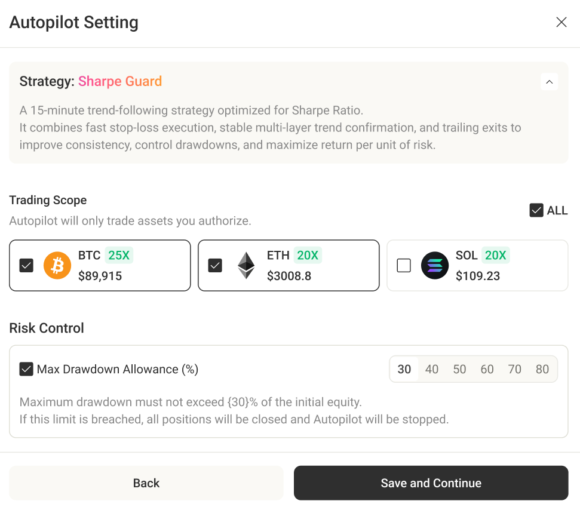

# Introduction


The Early Access is open. Join the waitlist: [https://minara.ai/join-waitlist](https://minara.ai/join-waitlist)


## What is Minara?

Minara is not just another AI chatbot—\
**she's an all-powerful financial AI assistant like no other.**

Ask anything about digital finance—stocks, crypto, RWA, DeFi, NFTs, and more. Trade any asset in one place, and create powerful agents with just your words, no code required. With Minara, everything is possible.

<table><thead><tr><th width="346.65234375">Feature</th><th width="190.7265625" align="center">Generic Chatbots like ChatGPT and Grok</th><th align="center">Minara AI</th></tr></thead><tbody><tr><td>Accurate, real-time crypto &#x26; stocks data</td><td align="center">❌</td><td align="center">✅ </td></tr><tr><td>Trusted &#x26; actionable financial insights</td><td align="center">Weak</td><td align="center"><strong>Strong</strong></td></tr><tr><td>Precise sentiment detection</td><td align="center">Weak</td><td align="center"><strong>Strong</strong></td></tr><tr><td>Built-in crypto wallet</td><td align="center">❌</td><td align="center">✅</td></tr><tr><td>Vibe trading with stablecoins</td><td align="center">❌</td><td align="center">✅</td></tr><tr><td>Gasless on-chain executions</td><td align="center">❌</td><td align="center">✅</td></tr><tr><td>Creating custom financial workflows without coding</td><td align="center">❌</td><td align="center">✅</td></tr></tbody></table>

## Why We build Minara?

With AI and blockchain technologies maturing—and the [GENIUS](https://en.wikipedia.org/wiki/GENIUS_Act) and [CLARITY](https://en.wikipedia.org/wiki/Clarity_Act) Acts being passed—**we’re entering an era where everyone can take part in next-gen digital finance.**

We define next-gen digital finance as a 24/7 global open financial network, with the following core pillars:

1. **Stablecoins** as the main currency for global trade,
2. **Public** **blockchains** as the core infrastructure for asset transfers,
3. **Tokens and NFTs** as standard formats for both digital-native and real-world assets (RWA),
4. **DeFi protocols** as the foundation for open, smart contract-based investment products.
5. **AI will serve as a 24/7 wealth manager,** assisting humans in partial or full asset management.

A typical user story is shown below:

<figure><figcaption></figcaption></figure>

In the past 5 years, digital finance is growing fast—but it’s also getting more complex. On-chain ecosystems evolve rapidly, while crypto wallets are still clunky and hard to use. This keeps the entry barrier high for newcomers. We believe the current tools aren’t enough to onboard the next wave of users.

That's why Minara is here: **we need a brand new AI interface that replaces complexity with chatting and brings everyone into the digital finance—regardless of background or skill.**

## Who is Minara for?

Minara is perfect for anyone interested or involved in digital finance.&#x20;

Whether you’re trading, exploring DeFi, hunting airdrops, or just getting started—if you struggle to find clear crypto insights, track market trends, spot alpha, or build custom financial workflows, **Minara is your ideal partner.**

## What makes Minara different?

### Web3-native LLM

Optimized with domain-specific data and an extensive digital finance knowledge graph, offering enhanced accuracy and efficient tool utilization.

### Real-time Financial Data Integration

Minara has integrated numerous industry data sources covering the following categories:

* **Finance Data:** Transactions, stocks, crypto, DeFi, NFTs, liquidation, Web3 project/VC information, etc.
* **Audience Data:** Entities, holders, smart money, social identities, P\&L, relationships, etc.
* **Sentiment Data:** News, X posts and trends, Greed/Fear index, macro signals, policy headlines, etc.

With access to over [**50+ leading data providers**](features/tools-integration.md), Minara offers real-time, actionable insights into financial markets, Web3, and crypto.

### AI-powered Access To Digital Finance

Access raw data and protocols across multi-chains. Trade crypto and stocks with stablecoin through a built-in custodial agent wallet.

### Agent Factory

Prompt to create any kinds of financial workflows, like trading, monitor or yield agents—no code required.

***

By combining these insights with proprietary strategies, we are confident that Minara has become your best companion in your digital financing journey.&#x20;

