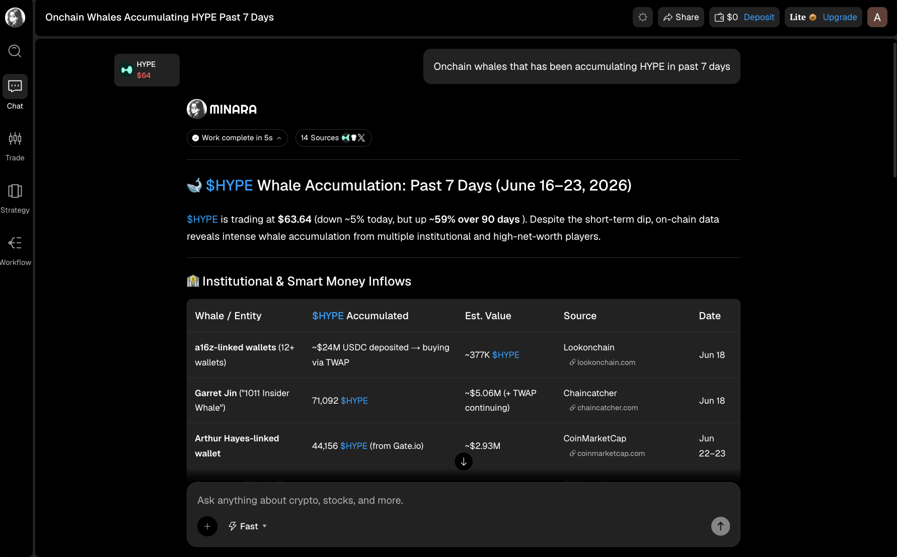
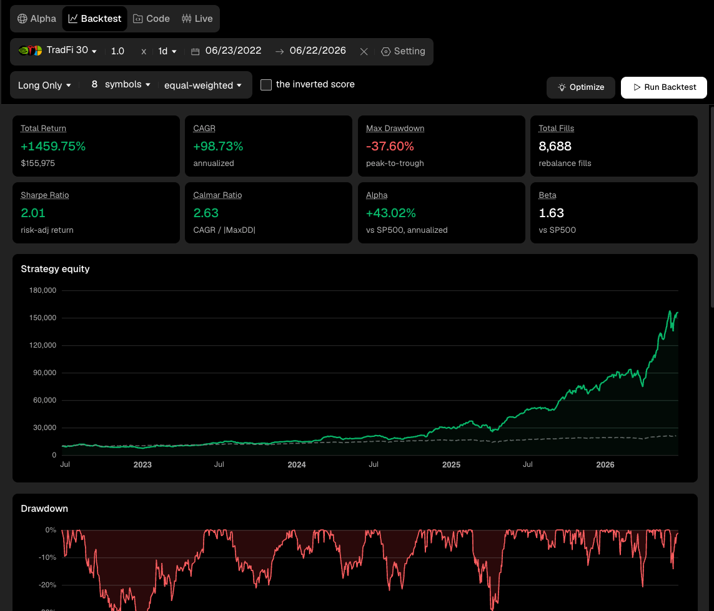
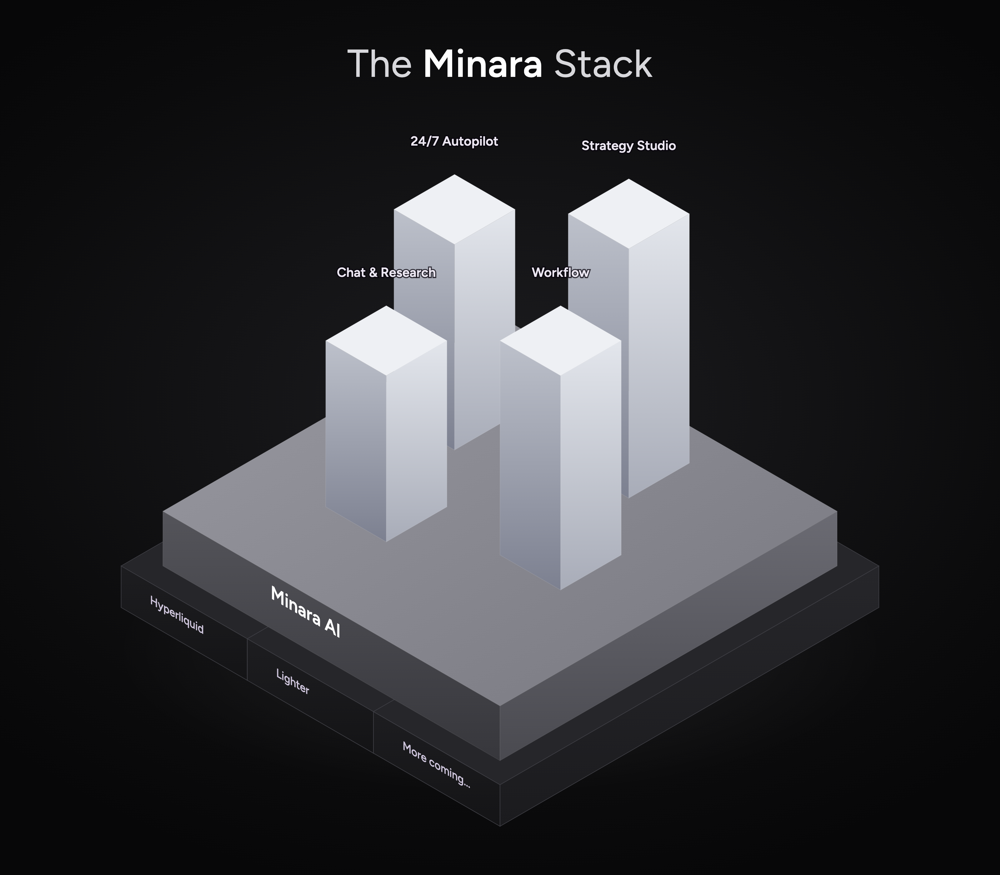

# About Minara

Minara is a purpose-built AI agent for digital finance: autonomous execution, research, and portfolio management across spot, perps, DeFi, equities, commodities, and FX.

You can ask, do research, and trade any digital assets proactively, write and backtest your own quant strategies, or run strategies built by other traders.

## Why Minara？

Most traders juggle a separate app for each job: one for charts, another to place orders, a spreadsheet to track positions, and a chatbot that can't see live prices. Minara folds those into one product, built on a financial AI model that works from live market data.

You ask in plain language. The model reads live prices and on-chain data, gives you analysis you can check, and places the trade or runs the strategy you decide on. Trade it yourself or let it run while you're away; either way, it's one window.

<figure><figcaption></figcaption></figure>

<figure><figcaption></figcaption></figure>

### The Minara stack

It all sits on one base. Minara AI is the foundation, wired to execution venues like Hyperliquid and Lighter, with more being added. The surfaces you work in are built on top of it: chat and research, 24/7 Autopilot, workflows, and Strategy Studio. Whichever one you open, it reads from the same account, balance, and live data.

<figure><figcaption></figcaption></figure>

## Who Minara is for

Minara fits a few kinds of traders.

* **US equities and TradFi traders.** Trade tokenized US stocks like AAPL, TSLA, and NVDA, plus commodities such as gold and oil. Settle in stablecoins, use leverage, and trade outside regular market hours.
* **Quant and systematic traders.** Write strategies in Pine Runtime, backtest them against minute-level history, and deploy to a live account without standing up your own infrastructure or execution layer.
* **Independent and discretionary traders.** Get a read on any ticker or event, then place the trade in the same window. Ask what the data says, and the answer comes back with the numbers behind it.
* **Crypto-native traders.** Trade spot across eight chains and perpetuals on Lighter or Hyperliquid, follow on-chain and smart-money flows, and price prediction markets, all from chat.

## What's inside

* **Chat and research.** Ask about a ticker, a wallet, or a market event and get an answer drawn from live data, with its sources shown.
* **Copilot.** The model flags the signal and the risk; you decide and place the order.
* **Autopilot.** Hand a strategy to Minara and it trades the rules for you, with fixed risk controls and a log of every action it takes.
* **Strategy Studio.** Write, backtest, and tune strategies in Pine Runtime, then send them to Autopilot.
* **Strategy marketplace.** Browse strategies from the Minara team and other traders, check their track record, and run a proven one on your own account.
* **Prediction markets.** Get probability estimates on Polymarket-style events, with the reasoning and data the model used to reach them.
* **Agent workflows.** Describe an automation in a sentence and Minara builds it: a price alert, a scheduled analysis, a DCA plan, or a copy-trading bot.
* **Agent API.** Call Minara's chat, swap, perp-suggestion, and prediction endpoints from your own app, paying by API key or x402.

## What you can trade

One account and one balance, for markets that normally live on separate platforms.

* **US stocks and commodities:** AAPL, TSLA, NVDA, AMZN, MSFT, gold (XAU), silver, crude oil, etc. via Hyperliquid.
* **Crypto:** BTC, ETH, SOL; perpetuals via Lighter or Hyperliquid; spot across 8 chains.
* **Events:** prediction markets with Polymarket coverage.

## The model underneath

Minara runs on [DMind](https://huggingface.co/DMindAI), a model trained on financial and market data rather than the open web. It reads live prices, on-chain flows, equity fundamentals, and sentiment from more than 40 data providers, so its answers track the current market instead of a training snapshot.

* 40+ data providers wired in
* 3 asset classes in one chat
* 8 chains for spot trading

## How it compares

### Chatboxes

| Capability                             | General chatbots | Minara |
| -------------------------------------- | ---------------- | ------ |
| Live crypto, stock, and commodity data | No               | Yes    |
| Analysis you can act on, with sources  | Weak             | Strong |
| Market sentiment read in real time     | Weak             | Strong |
| Built-in wallet and order execution    | No               | Yes    |
| Backtest and deploy quant strategies   | No               | Yes    |
| No-code automated trading workflows    | No               | Yes    |

### Brokers

| Capability                                        | Brokers & exchanges | Minara |
| ------------------------------------------------- | ------------------- | ------ |
| Crypto, US stocks, and commodities in one account | Partial             | Yes    |
| AI research and analysis built in                 | No                  | Yes    |
| Build and backtest quant strategies               | No                  | Yes    |
| Plain-language strategy authoring (no code)       | No                  | Yes    |
| Automated execution (Autopilot)                   | Manual              | Yes    |
| No-code automation workflows                      | No                  | Yes    |

### Strategy Platforms

| Capability                                     | TradingView / QuantConnect | Minara |
| ---------------------------------------------- | -------------------------- | ------ |
| Build strategies without writing code          | Code required              | Yes    |
| AI research with citations, in plain language  | No                         | Yes    |
| Vetted factor library, IC + source per factor  | Limited                    | Yes    |
| Backtest and deploy to live in one place       | Via brokers                | Yes    |
| Built-in wallet and one-click execution        | Via brokers                | Yes    |
| Multi-asset: crypto, equities, FX in one agent | Partial                    | Yes    |
