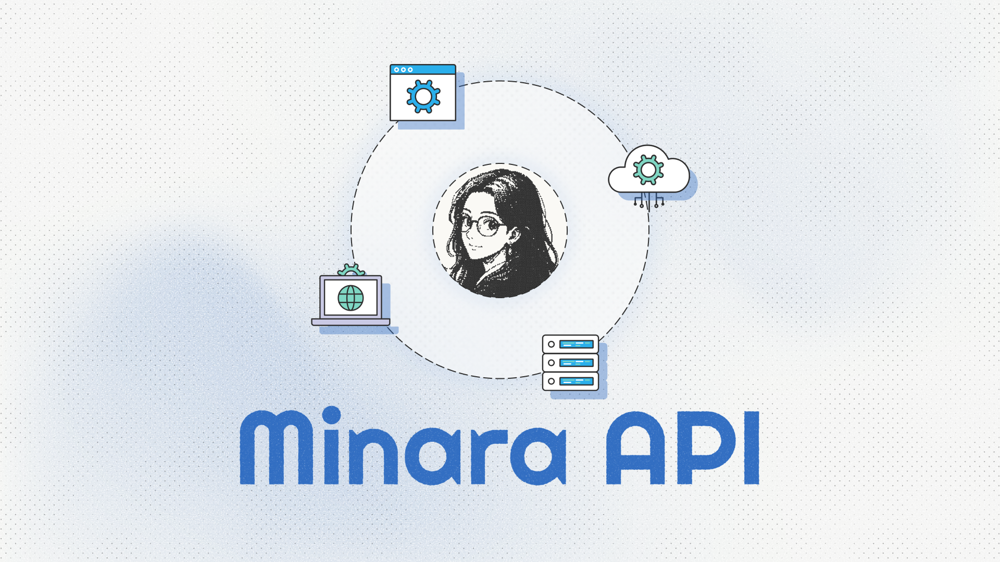

# Agent API

The Minara Agent API gives developers, traders, and market analysts direct access to Minara's financial intelligence and trading execution through a standard HTTP interface.

<figure><figcaption></figcaption></figure>

### Key features

**Real-time market data.** Query live data across crypto and stocks: wallet activity, DeFi metrics, on-chain flows, and alpha signals — all structured for agent consumption.

**Trade suggestions.** Send a market context query and get back a direct long/short recommendation with a preset order payload you can execute immediately. Reduces the loop from signal to trade.

**Text-to-swap.** Describe a trade in plain English; the API returns an executable on-chain transaction payload compatible with OKX DEX by default.

**Prediction market.** Query AI-estimated probability distributions for event outcomes, backed by market data, news context, and uncertainty bands. Use it to identify mispriced odds and size positions with clearer risk boundaries.

### How it works

Two billing methods:

1. **API Key** — Available with a **Pro or Partner** plan. Generate keys directly from your Minara profile.
2. **Pay-As-You-Go** — A flexible, permissionless option via the [x402 protocol](https://www.x402.org/), allowing usage-based payments with stablecoins like $USDC.

\
**Ready to build?** Follow our guides to [getting-started-by-api-key.md](getting-started-by-api-key.md "mention").
