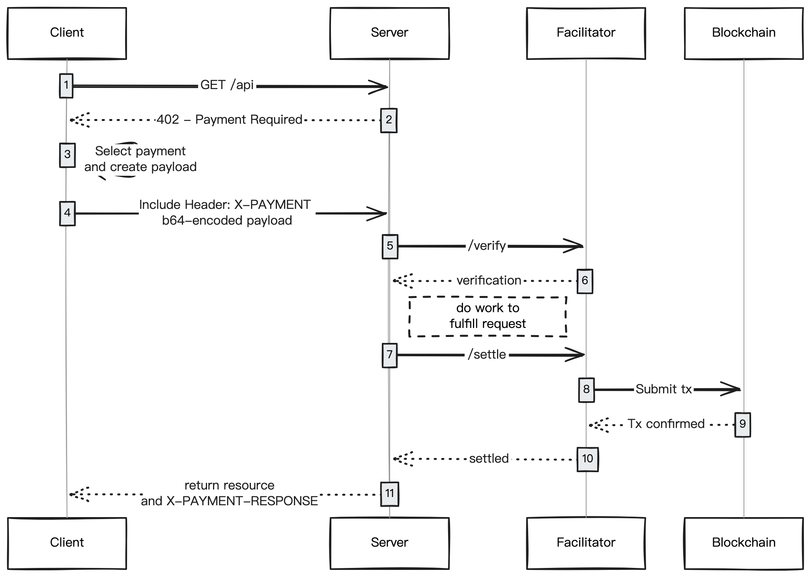

# Getting Started By x402

The x402 protocol (also known as L402) is an emerging standard for API monetization that enables pay-per-use access without requiring a subscription.

Minara x402 endpoint: `https://x402.minara.ai`

<figure><figcaption></figcaption></figure>

### What is x402?

x402 is a native "pay-to-play" system for the web. Instead of pre-paying for a subscription, you pay for each API call directly using stablecoins like $USDC.

**Key Benefits:**

* **No Subscription Required:** Pay only for what you use
* **Permissionless Access:** No account creation or approval process
* **Instant Activation:** Start using APIs immediately after payment
* **Crypto-Native:** Payments in USDC on Base, Solana, or Polygon
* **Transparent Pricing:** Know exactly what each API call costs

### How it works:

<figure><figcaption></figcaption></figure>

The x402 protocol follows a payment-challenge flow with these key steps:

#### The Complete Flow

1. **Initial Request** (Client → Server)
   * You make an API request to a protected endpoint without payment
2. **Payment Challenge** (Server → Client)
   * Server responds with `402 Payment Required` status
   * Returns payment instructions (amount, currency, recipient address, chain)
3. **Payment Selection** (Client)
   * You select a payment method and create a payment payload
   * Prepare to pay with USDC on the specified chain
4. **Authenticated Request** (Client → Server)
   * Include payment proof in `x-payment-response` header
   * Retry the original request
5. **Verification** (Server → Facilitator)
   * Server sends payment proof to facilitator for verification
   * Confirms payment validity
6. **Payment Processing** (Facilitator → Blockchain)
   * Facilitator submits transaction to blockchain
   * Transaction confirmed on-chain
7. **Settlement** (Facilitator → Server)
   * Facilitator confirms settlement to server
   * Payment is finalized
8. **Access Granted** (Server → Client)
   * You receive the API response
   * Payment receipt included in `X-PAYMENT-RESPONSE` header

#### Key Components

* **Client**: Your application making API requests
* **Server**: Minara API endpoints (`https://x402.minara.ai`)
* **Facilitator**: Payment verification and settlement service
* **Blockchain**: On-chain payment settlement (Base, Solana, or Polygon)

***

### How to Use x402 with Minara

#### Step 1: Explore Available Endpoints

Visit [Minara on x402scan](https://www.x402scan.com/server/66307a3c-aeb9-4508-9531-71eed69bc9b5) to see Minara's available x402 endpoints and their pricing.

**Available endpoints include:**

* Chat (fast/expert mode)
* Intent to Swap Transaction
* Perpetual Trading Suggestions
* Prediction Market Analysis

#### Step 2: Make Your First Request

Make a request to any x402 endpoint **without** payment credentials:

```bash
curl -X POST https://x402.minara.ai/x402/chat \
  -H "Content-Type: application/json" \
  -d '{
    "userQuery": "What is the current price of BTC?"
  }'
```

#### Step 3: Receive Payment Challenge

The server responds with `402 Payment Required`:

```json
{
  "error": "payment_required",
  "message": "Payment required to access this resource",
  "paymentInstructions": {
    "amount": "0.20",
    "currency": "USDC",
    "recipient": "0xCF5815e9063FA0b04Be0Cb5C1DB583eeF9ef5fbB",
    "chain": "base"
  }
}
```

**What this tells you:**

* **Amount**: $0.20 USDC
* **Recipient**: Payment address
* **Chain**: Pay on Base network

#### Step 4: Complete Payment

Use a compatible wallet to pay the specified amount in USDC to the recipient address on the specified chain.

**Supported Chains:**

* **Base** - Recommended for fast, low-cost transactions
* **Solana** - High-speed payments
* **Polygon** - Ethereum-compatible

**Compatible Wallets:**

* MetaMask (for Base/Polygon)
* Phantom (for Solana)
* Any Web3 wallet supporting the respective chain

#### Step 5: Retry with Payment Proof

After payment is confirmed, you'll receive a payment proof token. Include it in the `x-payment-response` header:

```bash
curl -X POST https://x402.minara.ai/x402/chat \
  -H "x-payment-response: <payment_proof_token>" \
  -H "Content-Type: application/json" \
  -d '{
    "userQuery": "What is the current price of BTC?"
  }'
```

#### Step 6: Receive Your Response

Success! You'll receive the API response:

```json
{
  "content": "BTC is currently trading at $98,450. Key support levels are at $96,500 and $94,200. The recent breakout above $97,000 with strong volume suggests bullish continuation..."
}
```

***

### Implementation Tips

#### Header Format

Minara's x402 implementation uses:

```
x-payment-response: <payment_proof_token>
```

This header contains the cryptographic proof of payment obtained after completing the payment challenge.

#### Error Handling

**Common Errors:**

**402 Payment Required**

```json
{
  "error": "payment_required",
  "message": "Payment required to access this resource"
}
```

→ Complete payment and retry with proof

**401 Unauthorized**

```json
{
  "error": "unauthorized",
  "message": "Invalid payment response token"
}
```

→ Payment proof is invalid or expired, retry payment

**400 Bad Request**

```json
{
  "error": "bad_request",
  "message": "Missing required parameter: userQuery"
}
```

→ Check your request parameters

#### Rate Limits

x402 endpoints are rate-limited per wallet address:

* **AI Endpoints**: 60 requests per minute
* **Trading Endpoints**: 30 requests per minute

#### Resources

For implementation, explore libraries and tools compatible with the L402/x402 protocol:

* [x402 Protocol Documentation](https://docs.x402.org)
* [x402scan - Browse Endpoints](https://x402scan.com)
* Compatible wallet SDKs (Web3.js, ethers.js, @solana/web3.js)

## API Reference


[api-reference-x402.md](api-reference/api-reference-x402.md)

