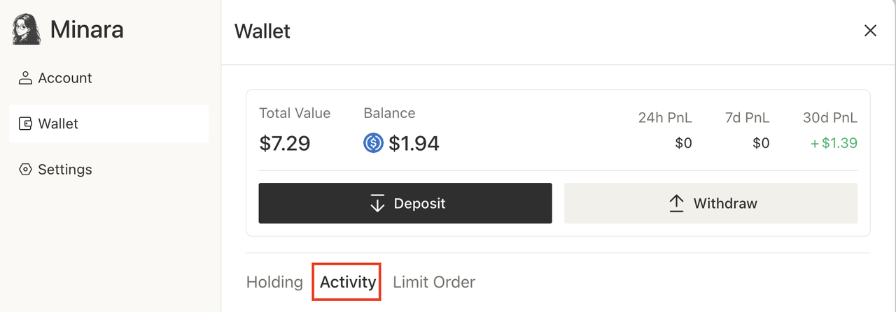

# FAQs

### Getting Started with Minara

#### **1. How should I ask questions to Minara?**

Open the chat window with Minara, and you can type any question or request just like talking to a friend—no complicated commands required. For example:

* "Help me analyze this KOL @elonmusk"
* "Is it a good time to buy ETH now?"
* "Buy $100 ETH for me."

Minara understands context and supports continuous dialogue. You can even use simplified expressions like “buy $10 more” or “cancel the last order.” Whether it’s technical analysis, market research, or direct trading execution, everything can be done in one sentence.

#### **2. What can Minara help me with?**

Minara can assist you throughout the entire process, from data analysis and decision-making to on-chain execution. You can ask Minara nearly any question related to Web3, such as:

* "What token should I buy now?"
* "Analyze trader James Wynn’s strategy and motives"
* "What's the crypto market trend for the next month?"
* "Should I buy the dip or sell my BTC now?"
* "Execute a trade for me directly"

Minara responds quickly and executes precisely. Additionally, Minara's built-in **DeepResearch** module can perform multi-stage reasoning and generate detailed, beautiful research reports on complex topics, like "Compare the technical architecture and development potential of Solana and Sui."

Minara also supports **Prompt-to-Agent**, enabling you to create automated workflows (e.g., monitor on-chain transactions and trigger actions) through simple dialogue with Minara, and manage them through a visual interface.

#### **3. Where can I manage my subscription plans?**

Managing your subscription is simple. Click **“Manage”** in the top right corner to access the subscription management page, where you can view your current plan details, usage, and billing cycle. You can upgrade or downgrade your plan at any time. Upgrades will take effect immediately once payment is completed, and downgrades will take effect in the next billing cycle.\
For more details, visit: [subscription-and-top-up-policy.md](subscription-and-credits/subscription-and-top-up-policy.md "mention")

#### **4.** How is the plan priced? How many times can I ask for 1 USD?

Credit consumption depends on the complexity of your question, the tools invoked, and the amount of AI processing required. Please refer to [how-credits-work.md](subscription-and-credits/how-credits-work.md "mention") for the detailed mechanism.

In general:

* **Standard Chat ≈ 30 credits per message**
* **Deep Research ≈ 70 credits per message**

Therefore, the number of questions you can ask for 1 USD (or any other specific amount) depends on the type and complexity of your queries.

#### **5.** What are Credits? What are Bonus Sparks?

**Credits:** Minara’s unit of usage. Every time you perform AI processing or run workflows with certain node types, credits are deducted based on the tokens consumed. For more details, please check out [how-credits-work.md](subscription-and-credits/how-credits-work.md "mention")

**Bonus Sparks:** Extra reward points included in subscription plans. More Spark-based features will be introduced in the future in [spark.md](features/spark.md "mention")— stay tuned for what they can unlock.&#x20;

***

### Trading & Asset Management

#### **1. What types of assets and chains does Minara support?**

Minara currently supports major chains such as Solana, Ethereum, Base, BSC, Arbitrum, and Optimism, with plans to expand its ecosystem coverage. Whether you want to quickly enter a trending token or need refined strategy execution, Minara is here to help—just ask!

#### **2.Does Minara support cross-chain trading?**

Yes. You can use assets on one chain (e.g., USDC, USDT) to purchase tokens on another chain (including meme coins). Minara automatically handles cross-chain transfers without the need for manual bridging or network switching—it's simple and efficient.

#### **3. What types of trades does Minara support?**

Currently, Minara supports:

* **Spot trading**
  * Supported order types: market orders and stop market orders.
* **Custom strategy trading based on workflows**
  * Example: copy trading by address, split entry and exit, etc.

Future support will include:

* Futures trading
* Automated arbitrage/wealth management
* Structured DeFi product integration
* Other advanced features

#### **4. How does Minara handle failed trades?**

Minara uses a multi-layer security mechanism to ensure transaction reliability and fund safety. Before execution, critical parameters like account balance, gas fees, and slippage settings are automatically checked. During execution, if network congestion or price volatility occurs, Minara will intelligently adjust gas fees and retry automatically. If a trade ultimately fails, the system will provide a detailed error analysis and suggestions. All operations are logged, so you can easily track execution status and avoid worrying about funds being stuck.

#### **5. Will Minara execute trades without authorization?**

Minara strictly adheres to the security principle of **“user authorization first.”** Minara will never execute any trade without your explicit consent. Each trade requires your confirmation, and large transactions will trigger a secondary confirmation. For automated strategies (e.g., copy trading, DCA), Minara will only execute once you’ve explicitly set and activated them. You can pause, modify, or stop these strategies at any time.

#### **6. Where can I view and track my trades and activity history?**

You can track your trades and activities by clicking **“Asset - Activity”** to view your transaction history and account activity.



<figure><figcaption></figcaption></figure>



<figure><figcaption></figcaption></figure>



#### **7. Does Minara support manual intervention in trading strategies?**

Minara's design philosophy is "AI automation + human control." You have full control over all trading strategies. Whether it's an active automated strategy or a limited order, you can pause, modify parameters, or stop them at any time. This flexible control mechanism ensures you enjoy AI efficiency while maintaining decision-making authority at critical moments.

#### **8. What wallet solution is Minara based on? Is it safe?**

One major advantage of Minara is that it creates a custodial smart wallet for each user. You don’t have to hold gas tokens (like $ETH or $SOL) or learn how multi-chain crypto wallets work—Minara simplifies it for you.\
Unlike traditional centralized exchanges, this custodial smart wallet is not stored in Minara's internal database but is an on-chain smart contract wallet. Minara can manage the funds in this wallet but cannot hide, delete, or blacklist it. Customizing wallet management will be supported in the future.\
For more details, visit: [wallet-security.md](features/wallet-security.md "mention")

#### **9.** What should I do if Minara’s answer seems inaccurate or doesn’t match my expectation?

1. **If it’s a factual error (e.g., price, volume, TVL):**

If you notice an error in factual data (e.g., token price, trading volume), you can follow up directly:

* _“The BTC price you gave me is wrong. Please re-fetch and analyze again.”_

Minara sources data from multiple providers (CoinMarketCap, DeFiLlama, DexScreener, etc.). Short-term deviations may occur, especially for low-liquidity or newly listed assets. We recommend cross-checking key numbers before making major investment decisions.

2. **If the analysis doesn’t match your expectation (e.g. market interpretation):**

If the analysis or interpretation doesn’t match your view, you can prompt Minara to reconsider the query.&#x20;

For example:

You asked Minara to analyze the current BTC market. Minara concluded it’s **bullish**, but you believe it’s **bearish** and her reasoning didn’t convince you. The key is **how you follow up:**

**✅ Good practice:**

* Ask for multi-angle validation

> “Re-analyze BTC and show how each signal supports or contradicts a bullish/bearish view.”

* Compare plausible alternatives side-by-side

> “Please give me both sides: what would make the market look bullish, and what would make it look bearish? Then tell me which one seems stronger right now.”

This way, Minara is guided to re-check the reasoning process instead of just aligning with your opinion.

**❌ Wrong practice:**

> “I don’t think that’s right. I believe BTC is already bearish.”

(Minara may simply agree with you, which can bias her reasoning.)

#### **10.** What should I do if my deposit hasn’t arrived?

Blockchain confirmation times vary by network, but most deposits are completed within 5–30 minutes. If yours takes longer:

1. **Verify the details** – Make sure you used the correct deposit chain and address.
2. **Check on-chain status** – Use a blockchain explorer to confirm whether the transaction has been processed.
3. **Contact support** – If the transaction is confirmed on-chain but your balance hasn’t updated, please reach out via our [official Discord](https://discord.com/invite/minaraai) for assistance.

#### **11.** Why was my on-chain withdrawal rejected?

Common reasons include:

* **Insufficient balance** – Make sure to leave enough funds to cover gas fees.
* **Invalid withdrawal address format** – Double-check the address you entered.
* **Network mismatch** – The selected network does not match the withdrawal address.

Please review the above points one by one before attempting the withdrawal again.\
If the issue persists, please contact us via our official Discord for technical support.

#### **12.** Why can’t I deposit SOL from Binance to Minara?

Minara wallets are **AA+ custodial wallets**, which are fully secure and industry-standard. However, Binance’s mobile on-chain withdrawal currently does not support **certain secure wallet architectures**, including AA+ custodial wallets, multi-signature wallets, etc.\
To deposit SOL to your Minara wallet, you may:

* Use **Binance Web,** or
* Deposit via **BSC or another supported chain** instead.

#### **13.** I deposited tokens from an unsupported chain into Minara. What should I do?

Please visit our official Discord for technical support. We will do our best to assist you, but **there is no guarantee that your assets can be recovered**.\
⚠️ Common reasons for unrecoverable deposits include:

* Sending assets via an **unsupported blockchain**.
* Sending to an **incorrect recipient address.**

***

### Data Analysis & Insights

#### **1. What kind of data can Minara analyze?**

Minara has powerful cross-domain data analysis capabilities. She can track core data like on-chain transactions, token holdings, KOL copy-trading, and DeFi protocol yields. Additionally, she analyzes price trends, fund flows, and smart contract deployment signals. Minara also supports **interlinked analysis** with crypto-related U.S. stocks (e.g., Coinbase, MicroStrategy) and macro-market trends.

Minara’s analysis includes but is not limited to:

* **On-chain behavior analysis**: wallet interactions, capital flows, degen behavior identification, etc.
* **Market dynamics**: token price trends, stock movements, trading depth, position structure, liquidation data, etc.
* **KOL & community sentiment**: topic heat, sentiment fluctuations, hot topic clustering on social media platforms (X, Telegram, etc.)
* **Airdrops & new projects**: airdrop hype, token issuance monitoring, project popularity changes, etc.

Minara doesn’t rely on web searches for insights but integrates over 50 leading data sources via APIs (e.g., Arkham, CoinMarketCap, Glassnode, NFTGo, DeFiLlama). This enables you to obtain actionable Web3-related insights through natural language conversation.

#### **2. How to verify Minara's information sources?**

Minara is committed to providing transparent and verifiable information. All key data and conclusions in the analysis processes are labeled with specific sources—you can click links to view the original data. Real-time data like price and market cap will show the timestamp and API source. News and social media info will include original links for full context. If you have doubts about the accuracy of any information, ask "Where is this data from?" and Minara will explain in detail. We encourage critical thinking—especially for investment-critical data. Cross-verifying from multiple sources ensures accuracy and timeliness.

***

### Troubleshooting Crypto Deposit with Card

Some users prefer to deposit crypto using credit or debit cards via third-party OTC (Over-The-Counter) services. This section answers common questions and issues that might come up. Please refer to [#deposit-using-a-credit-card](guide/managing-funds-and-trading/how-to-deposit-funds.md#deposit-using-a-credit-card "mention") if you are looking for tutorials.

#### **1. What if my credit card deposit fails?**

Minara integrates multiple OTC payment channels, but due to policy restrictions and bank risk controls in different countries or regions, credit card payments may fail. If this happens, try using a different card or payment method/channel. In addition to OTC payments, you can also deposit crypto to your Minara wallet address.

#### 2. Are there other ways to get crypto besides OTC payment?

Yes! You can deposit cryptocurrency directly into your Minara wallet from another wallet or exchange. Please refer to [how-to-deposit-funds.md](guide/managing-funds-and-trading/how-to-deposit-funds.md "mention") for more details.

#### 3. I paid, but I haven’t received my crypto — what should I do?

Don't worry — in most cases, if the transaction fails, your funds will be automatically refunded to your original payment method.

If you haven’t received your crypto or a refund after **24 hours**, please contact the customer support of the specific OTC provider, and provide your **payment proof and order ID**.

Here are the links for the OTC providers currently integrated with Minara:

* **Alchemy Pay:** [https://ramp.alchemypay.org/](https://ramp.alchemypay.org/)
* **Banxa Pay:** [https://support.banxa.com/en/support](https://support.banxa.com/en/support)
* **Kodo Finance:** [https://global.kodo.finance/](https://global.kodo.finance/)

⚠️ _Note: Minara does not operate these services_ and isn’t able to step in on their behalf. _We only aggregate third-party OTC providers._

#### 4. Why did I receive less crypto than I paid for?

This is common and usually due to:

* Platform or processing fees
* Exchange rate slippage
* Payment provider fees
* Blockchain gas fees

If the difference seems unusually large, we recommend contacting the OTC provider directly with your **transaction details and receipt**.

#### 5. Why I can't pass KYC?

Minara integrates with multiple third-party OTC payment providers. Due to varying regulatory requirements across countries/regions and bank risk-control measures, your KYC verification may occasionally fail.

We recommend:

* Trying a different bank card
* Selecting an alternative payment method or channel
* Contacting the corresponding provider’s customer support:
  * **Alchemy Pay:** [https://ramp.alchemypay.org/](https://ramp.alchemypay.org/)
  * **Banxa Pay:** [https://support.banxa.com/en/support](https://support.banxa.com/en/support)
  * **Kodo Finance:** [https://global.kodo.finance/](https://global.kodo.finance/)

⚠️ _Note: Minara does not operate these services_ and isn’t able to step in on their behalf. _We only aggregate third-party OTC providers._

***

### Technical Issues & Support

#### **1. What if I encounter problems while using Minara?**

Minara provides multi-channel user support to ensure your issues are resolved promptly. The most direct way is to tell Minara in the chat, "I have a problem," and she will immediately offer preliminary troubleshooting suggestions. For complex issues, visit [faqs.md](faqs.md "mention") to view FAQs. If the documentation doesn’t solve your problem, you can go to our [official Discord channel ](https://discord.com/invite/minaraai)to submit a ticket— community moderators and experienced users are there to help in real time. Whether it's technical issues, usage questions, or feature suggestions, we welcome your feedback.

#### **2. What if hallucinations occur in the conversation?**

While Minara is built on cutting-edge large models and connects to dozens of authoritative data sources, AI systems may occasionally produce incorrect information or "hallucinations." If you notice incorrect information, point it out immediately (e.g., "This price is wrong" or "This project info is inaccurate"), and Minara will re-verify and correct it. For critical investment decisions, we recommend cross-verifying key information and asking Minara to provide source links. Your feedback is essential for improving the AI system—each correction helps make Minara more accurate and reliable.

#### **3. Why can't I access Minara?**

Access issues can usually be resolved by following these steps:

* Check if your network connects from a restricted country or region (e.g., Mainland China, North Korea, etc.)
* Confirm that your internet connection is working by visiting other websites
* Check for browser issues: clear cache and cookies, try incognito mode, or switch browsers
* If you're on mobile, try switching between Wi-Fi and mobile data.\
  Most access issues can be resolved with basic troubleshooting. If problems persist, visit the official Discord for technical support.

#### **4. Why didn’t Minara give me any output?**

If you received no output at all:

1. Check whether you still have credits and confirm your subscription hasn’t expired.
2. Refresh the page or start a new chat, then try again.
3. If there’s still no output, please visit our [official Discord](https://discord.com/invite/minaraai) for support.

If the output is not what you expected:

* Ask more specific questions — for example, **“BTC price trend analysis for next week”** is more effective than **“Give me a way to make money.”**
* Use follow-up questions to refine your request so Minara can better understand your needs.

#### **5.** My data isn’t syncing between mobile and desktop — what should I do?

Make sure you’re logged into the **same account** on both devices, then try refreshing or logging in again.

For now, we recommend primarily using the **web version on Chrome (PC)**, as our native mobile app is still in development.

#### **6. What should I do if my account is hacked?**

If your login method (email or Google) is compromised, please:

1. **Change your password of the hacked account immediately.**
2. **Log in to Minara** and:
   * Check the **Activity** page for any suspicious transactions.
   * Consider pausing all automated strategies.
   * Transfer out all assets to a secure wallet.
3. **If there is any asset loss**, keep all relevant evidence (e.g., screenshots, transaction records) for investigation.

***

### General Features & Functionality

#### **1. What advanced features will Minara offer in the future?**

Minara is planning to launch the following advanced features:

* DeFi Agents (wealth management, protocol interactions)
* Airdrop Claimer
* Voice input/interaction
* Discovery page

\
And many more exciting features yet to come!

***
