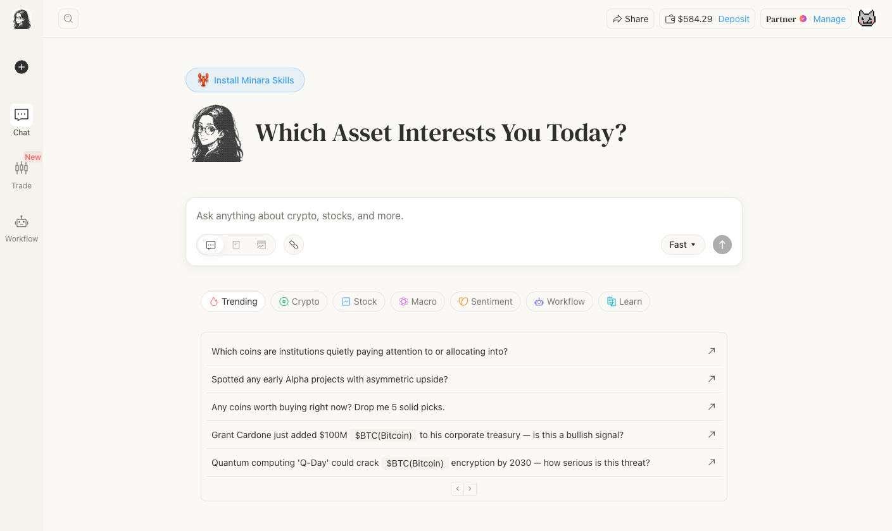

# What to ask Minara

Minara's chat handles research, analysis, and trade decisions across crypto, stocks, commodities, and macro. This page shows concrete examples by trader type — the kind of questions Minara answers well, and what you get back.

<figure><figcaption></figcaption></figure>

The tabs at the bottom of the chat input (Trending, Crypto, Stock, Macro, Sentiment, Workflow, Learn) show ready-made starting points. You can also type anything directly.

***

## Crypto traders

**Token research and fundamentals**

```
Summarize Hyperliquid's key competitors and differentiators.
```

```
Is the token distribution structure of Kaito reasonable?
```

```
How does $PENDLE's yield-trading mechanism work in DeFi?
```

Minara returns competitive landscape, tokenomics analysis, and mechanism breakdowns sourced from on-chain data, project documentation, and market data providers.

**On-chain and whale activity**

```
Is BTC still a good buy after the recent rally to $81k? Show me on-chain data and whale activity.

```

<figure><figcaption></figcaption></figure>

Minara pulls live on-chain data and returns: entry zone, price targets with standard deviation levels, stop loss, and an assessment of institutional accumulation vs. distribution from exchange flows.

**DeFi and yield**

```
Which DeFi protocols on Solana have the highest real yield right now?
```

```
Compare Pendle's fixed-yield pools for ETH — which maturity gives the best risk-adjusted return?
```

```
What are the top pools on Uniswap v3 by fee APR this week?
```

<figure><figcaption></figcaption></figure>

**Meme coins and alpha**

```
Spotted any early Alpha projects with asymmetric upside?
```

```
Which coins are institutions quietly paying attention to or allocating into?
```

```
Any coins worth buying right now? Drop me 5 solid picks.
```

<figure><figcaption></figcaption></figure>

***

## Stock traders

**Earnings analysis**

```
What does NVDA's latest earnings tell me about the AI hardware cycle? Is it still worth holding?
```

<figure><figcaption></figcaption></figure>

Minara returns a structured earnings breakdown — quarterly and annual metrics side by side — followed by a qualitative read on what the numbers mean for the sector. For NVDA: data center revenue hit $39.1B with 73% YoY growth, net margin expanded to 63.1%.

```
What does $JPM's Q1 earnings beat signal about banking sector health?
```

```
Summarize the key takeaways from $AAPL's latest earnings report.
```

```
What risks does $META's $145B capex plan pose to its profitability outlook?
```

<figure><figcaption></figcaption></figure>

**Sector and momentum**

```
What is driving $FLEX's post-earnings surge and cloud spin-off announcement?
```

```
Which S&P 500 sectors are showing the strongest institutional inflows this week?
```

```
Compare the 30-day performance of semiconductors vs. software vs. cloud infrastructure.
```

<figure><figcaption></figcaption></figure>

***

## Macro and cross-asset traders

**Multi-asset positioning**

```
With the Fed holding rates and tariff uncertainty, how should I position between gold, BTC, and Nasdaq right now?
```

<figure><figcaption></figcaption></figure>

Minara reads current macro data — Fed meeting minutes, inflation figures, GDP prints — and returns an asset-by-asset positioning table. In this example: Fed locked at 3.75% with hawkish tilt, inflation reaccelerated to 3.5% YoY, stagflation risk flagged, Gold overweight.

**Rates and policy**

```
How do rising Treasury yields typically affect $ETH valuations?
```

```
What does the latest Fed policy statement imply for risk assets?
```

```
How does a global risk-off environment affect $COIN stock performance?
```

<figure><figcaption></figcaption></figure>

**Geopolitical risk**

```
Which assets are most impacted by the US's new tariff policy?
```

```
How do geopolitical tensions in the Middle East affect $ETH price?
```

<figure><figcaption></figcaption></figure>

***

## Sentiment and social analysis

**KOL and narrative tracking**

```
What narratives is @loomdart pushing about $SOL lately?
```

```
Summarize @cz_binance's recent opinion on $BNB.
```

```
Which KOLs on X are most bullish on AI tokens this week?
```

<figure><figcaption></figcaption></figure>

Minara monitors X in real time and summarizes what influential accounts are saying about specific assets (useful for understanding narrative shifts before they show up in price).

**Fear, greed, and crowd positioning**

```
What is the fear and greed sentiment for $LINK on X today?
```

```
What is the current X sentiment around $ETH after the latest upgrade?
```

```
Is the hype around $PEPE fading or growing on X?
```

<figure><figcaption></figcaption></figure>

***

## Institutional and quantitative use

**Portfolio-level analysis**

```
Analyze trader James Wynn's on-chain strategy and positioning motives.
```

```
Show me the top 15 ETH whale addresses by holdings and visualize their distribution.
```

```
Which smart money wallets are accumulating $SOL in the last 72 hours?
```

<figure><figcaption></figcaption></figure>

**Deep research**

For structured research reports with sources, charts, and executive summaries, activate **Deep Research** mode from the chat toolbar. Examples:

```
Provide a comprehensive market analysis of Ethereum Layer-2 solutions.
```

```
Research the competitive positioning of Hyperliquid vs. dYdX vs. GMX for a fund memo.
```

Deep Research generates a downloadable report in PDF or Word format. See [Research and analysis](deep-research.md) for how it works.


Minara draws on 50+ data providers in real time — on-chain transactions, price data, X sentiment, DeFi metrics, macro indicators, and equity fundamentals. The more specific your question (asset name, chain, timeframe, what you want to decide), the more useful the answer.


<figure><figcaption></figcaption></figure>

<figure><figcaption></figcaption></figure>

<figure><figcaption></figcaption></figure>
