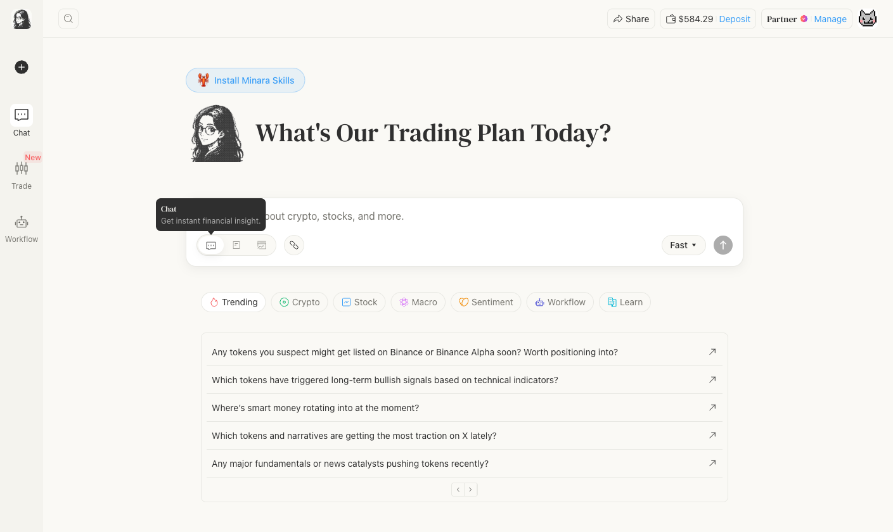
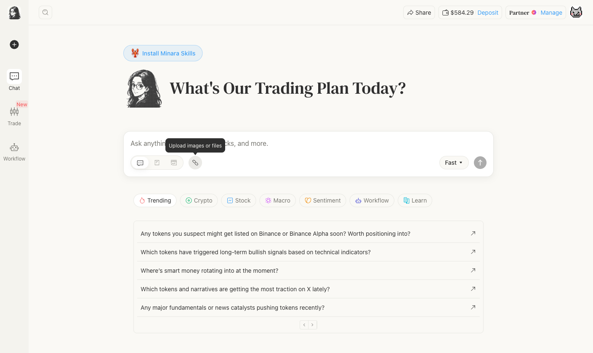
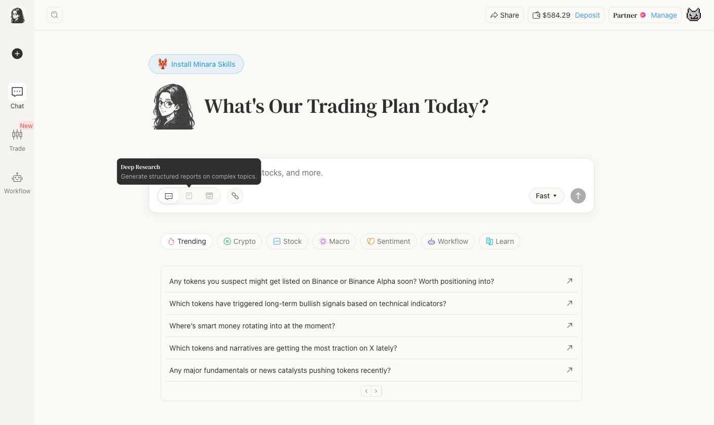
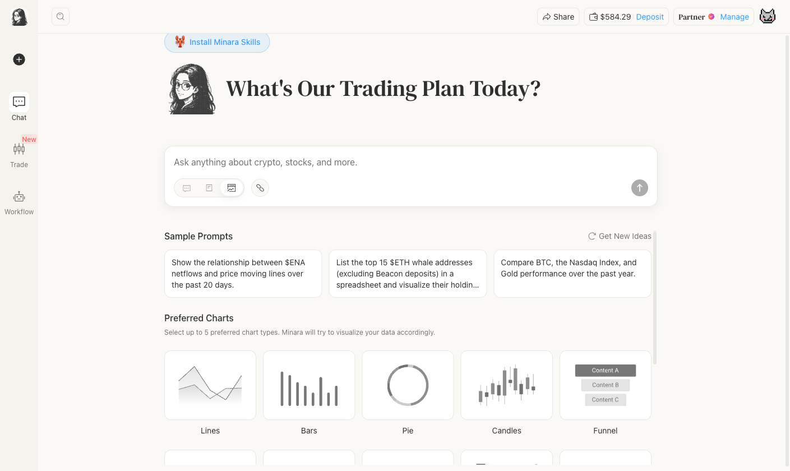

# Research and analysis

The Minara chat input has four modes, selectable from the toolbar beneath the text field. Each mode changes what Minara does with your question.

<figure><figcaption></figcaption></figure>

---

## Chat

**Tooltip:** Get instant financial insight.

The default mode. Ask any question about crypto, stocks, commodities, or macro. Minara queries its data sources in real time and responds in conversational format. Use this for price checks, quick analysis, trade signals, on-chain lookups, and follow-up questions.

Common examples: checking BTC price and on-chain metrics, reviewing ETH funding rates, looking up SOL whale activity, or asking about gold (XAU) macro positioning.

<figure><figcaption></figcaption></figure>

**Speed toggle**: in Chat mode, you can switch between two response depths using the toggle on the right side of the input:

- **Fast**: clear, concise answers with fewer reasoning steps. Good for quick checks.
- **Quality**: thorough explanations with structured insights. Use for complex analysis or trade decisions.

<figure><figcaption></figcaption></figure>

---

## Deep Research

**Tooltip:** Generate structured reports on complex topics.

Deep Research runs a multi-stage research workflow instead of responding immediately. Minara decomposes your question into tasks, queries multiple data sources in parallel, cross-validates findings, and produces a structured report with charts, citations, and an executive summary.

<figure><figcaption></figcaption></figure>

Use Deep Research when you need a shareable, source-backed output rather than a quick answer. For example: a fund memo on Ethereum's competitive positioning, a macro analysis of gold versus Bitcoin in a risk-off environment, or a sector overview of AI-related stocks like NVIDIA (NVDA), Microsoft (MSFT), and Amazon (AMZN).

Output is downloadable as PDF or Word.

**When to use Deep Research vs Chat:**

| | Chat | Deep Research |
|---|---|---|
| Response time | Seconds | 1–3 minutes |
| Output format | Conversational | Structured report with sections |
| Best for | Quick decisions, follow-ups | In-depth analysis, documentation |
| Downloadable | No | Yes (PDF / Word) |

---

## Data Visualization

**Tooltip:** Data in tables and visuals, on your command.

Data Visualization mode outputs structured tables and charts alongside analysis. When you activate it, you can select up to 5 preferred chart types before sending your question. Minara will try to produce your preferred chart types from the data.

<figure><figcaption></figcaption></figure>

**Available chart types:** Lines, Bars, Pie, Candles, Funnel, Scatter, Heatmap, Radar, Calendar, Treemap, Sankey, Sunburst, Network, Gauge.

**When to use Data Visualization:**

- Comparing multiple assets across a time range, for example BTC versus ETH versus SOL over 30 days
- Visualizing whale or holder distributions for a specific token
- Building a portfolio breakdown by chain or asset
- Tracking wallet activity with charts
- Comparing stock performance across sectors (AAPL, TSLA, NVDA, AMZN, MSFT)
- Turning a research output into a visual you can share


Data Visualization queries typically cost more credits than standard Chat responses. The cost scales with the number of assets, the date range, and the number of charts rendered. Start with a table-only request if you want to control credit spend, then add charts in a follow-up.


---

## Upload images or files

The chain icon in the toolbar opens a file picker. You can attach images, Excel/CSV files, or PDFs alongside your question. Minara reads the content and incorporates it into its response, for example analyzing a chart screenshot you annotated, reviewing a trading journal in Excel, or summarizing a whitepaper PDF.

Up to 5 files, 10 MB each. See [Multimodal input](multimodal-input.md) for details and examples.
