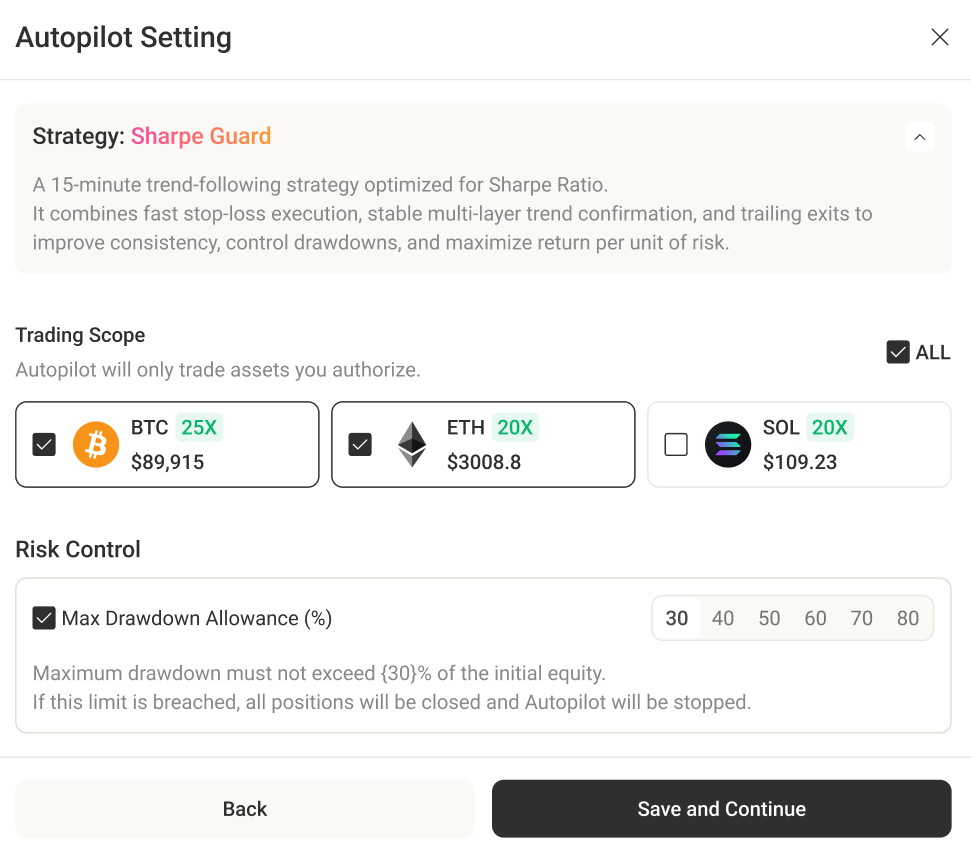

# Trading Autopilot

Trading Autopilot is Minara’s AI-powered strategy execution framework for perpetual trading, which allows AI to automatically run different predefined strategies based on their own trading logic.

Each strategy has its own:

* Timeframe
* Indicators
* Entry/exit rules
* Risk control framework
* Position management logic

### How Autopilot Works

1. User allocates funds in their perp wallet
2. User selects a strategy
3. AI runs the selected strategy automatically
4. Strategy detects signals and executes trades
5. Risk control and TP/SL are handled programmatically

Autopilot does not make discretionary trades outside strategy rules.

All trading behavior depends on the chosen strategy.


Autopilot is built around three principles:&#x20;

* Every automated action is visible and explainable
* Users can override any time
* Any manual action that conflicts with AI execution is treated as a deliberate override and handled explicitly in-product


### How to Access

Path: [**Trade**](https://copilot.minara.ai/) **→ Perps → Autopilot**



.png>)

Copilot Mode



.png>)Click Autopilot Tab



.png>)Start Autopilot



* Minara plan subscribers can run Autopilot. Autopilot is not yet open to free users.
* If a user's subscription expires while Autopilot is already running, they can keep viewing and operating the Autopilot panel. However, they won't be able to start Autopilot without resuming their subscription.

***

### Current Official Strategies

Minara currently provides the following official strategies:

**Standard AI Strategies** (Sharpe Guard, Supertrend Monitor, etc.):

AI performs the following on your behalf, within your authorized trading scope and risk settings:

* Open positions automatically
* Manage positions (including positions you already have, when eligible)
* Place take-profit and stop-loss orders, and update stop-loss as market conditions change
* Reverse positions when market conditions reverse
* Apply global risk controls (e.g., maximum drawdown)
* Exit and notify you when safety conditions are triggered

**Classic Automated Strategies** (Futures Grid):

AI will suggest the grid parameters (grid amount, funding, upper/lower bounds) based on latest data. Once started, the grid engine _automatically places and manages orders_ based on these parameters without the sequential trigger/interpretation steps typical of AI strategy workflows.

#### 1. Sharpe Guard

Type: Trend-following

A 15-minute trend-following strategy optimized for Sharpe Ratio. It combines fast stop-loss execution, stable multi-layer trend confirmation, and trailing exits to improve consistency, control drawdowns, and maximize return per unit of risk.

#### 2. Supertrend Monitor

Type: Trend-following

SuperTrend Monitor continuously monitors multi-timeframe trend, momentum, and volatility conditions, opening positions only when confidence and risk-reward thresholds are met. With aggressive downside protection and adaptive Sharpe-based controls, the strategy prioritizes capital preservation while expanding profits via Supertrend trailing logic.

#### 3. Classic Futures Grid

Type: Range-bound

Classic long/short grid strategy.

AI dynamically suggests optimized grid parameters based on market volatility and structure.

Futures Grid cannot be enabled when there's any open position with the wallet, and all existing open orders will be canceled when enabling Futures Grid.&#x20;

### Customized Strategies (Coming Soon)

In addition to official strategies, Minara will soon launch Strategy Studio — an AI-assisted creative environment where users can:

* Describe trading ideas in natural language
* Let AI generate executable strategy logic
* Backtest ideas automatically
* Deploy them via Autopilot
* Share strategies with other users

This opens up:

* User-created strategies
* Community collaboration
* Ecosystem-level innovation

Autopilot will evolve from a fixed set of official strategies into a broader strategy ecosystem.

### Wallet Setup

**Minimum available funds**

Autopilot requires at least **$50** in available funds (available for Autopilot to trade) to operate.

For Futures Grid, a minimum required amount is calculated dynamically base on the parameters.

<figure><figcaption>
Real time available funds indicated here
</figcaption></figure>


**Available Funds = Perps Wallet Equity − Occupied Funds**

Occupied Funds = Autopilot margin in use + (if any) worst-case estimated loss of eligible user positions

Worst-case estimated loss is calculated based on the stop-loss trigger price, including estimated slippage and fees.


* If there are no open positions in your perps account, all equity is fully available for Autopilot to allocate into new positions.
* If you hold an existing position, the stop-loss-bounded risk of the existing position is treated as already “reserved,” and only the remaining equity can be used to size new positions.

To transfer funds into a Perp Wallet, users must first deposit USDC into their Spot Wallet, then manually transfer the funds to their Perp Wallet before starting Autopilot.

Alternatively, users may deposit **USDC** on **Arbitrum** directly into the Perp Wallet. Deposits from other chains or in other assets are not supported at this time. The minimum deposit amount is 10 USDC.


If a user deposits less than 10 USDC (e.g., 5 USDC), the funds will remain pending and will not be credited to the Perp Wallet. Once the cumulative deposited amount reaches 10 USDC or more (for example, depositing 5 USDC + 5 USDC), the total amount will be credited to the user’s Perp Wallet.


**Margin mode & position requirements**

Autopilot requires **cross margin** for all managed assets. When Autopilot starts:

* Any isolated margin position blocks starting.
* Any position outside the strategy trading scope blocks starting.

> e.g. If the current strategy applies only to BTC, ETH, and SOL, but the user holds an existing position in HYPE, Autopilot cannot be started until that position is closed.

***

### Starting Autopilot

<figure><figcaption></figcaption></figure>

On your first enablement:

1. Autopilot checks eligibility and minimum funds
2. You configure the **Trading Scope** (assets you authorize Autopilot to manage)
3. You confirm risk settings and start Autopilot

> * Within the trading scope, If you already have a cross position on any asset, the asset must be managed by Autopilot and cannot be unselected.
> * All existing open orders will be canceled when Autopilot starts.

On later enablement attempts, Autopilot reuses your last configuration (scope and risk settings).&#x20;

***

### Strategy and Trading scope

Each standard AI strategy comes with a preset trading scope that defines the assets to which the strategy applies. The following rules do not apply to classic automated strategies like Futures Grid.

When multiple assets trigger entry signals at the same time and the account supports fewer concurrent positions than available signals, Autopilot opens positions according to asset priority order.

***

#### Position Management

Autopilot places take-profit and stop-loss orders whenever a position is opened, following predefined rules, and trails the stop-loss when conditions allow.

If Autopilot detects rapid changes in technical indicators, it may close the position at market price to reduce losses or protect profits, rather than waiting for the stop-loss order to be triggered.

When conditions are met, Autopilot may close the original position at market price and open a new position in the opposite direction. The size of the new position is calculated using the same logic as other newly opened positions.

***

#### Manual Actions

Autopilot treats manual intervention as an intentional override and asks you how to proceed.

**Removing an asset from management**

If you remove an asset from Autopilot scope, Autopilot will not perform further actions on the asset.

However:

* If there is only one managed asset left, it cannot be removed
* If there is an active position on the asset, it cannot be removed.

**Transferring funds out of Perps Wallet**

Transferring funds out of perps wallet will stop Autopilot automatically.

Transferring funds into perps wallet will not stop Autopilot from running; incoming funds increase Autopilot's Available to Trade amount.

**Manual management on positions**

* User may close the positions at any time.
* User cannot cancel the TP/SL open orders when Autopilot is active.

***

#### Safety Exits

Autopilot can stop automatically under the following conditions:

**Initial Equity Drawdown Limit reached**

If the user enabled the Initial Equity Drawdown Limit and it is triggered:

* All Autopilot-managed positions will be closed at market price
* All pending Autopilot orders will be canceled
* Autopilot stops and sends an email notification&#x20;

**Account equity falls below minimum**

If perps account equity falls to ≤ $5:

* All Autopilot-managed positions will be closed at market price
* All pending Autopilot orders will be canceled
* Autopilot stops and sends an email notification

#### Risk and control notes

Autopilot is built to enforce trading discipline with mandatory TP/SL and trailing stop-loss updates, while leaving you with control over starting, stopping, position management, and the scope you authorize.&#x20;


However, please note that perpetual perpetual trading involves significant market risk. Autopilot does not eliminate market risk and does not guarantee profits.


