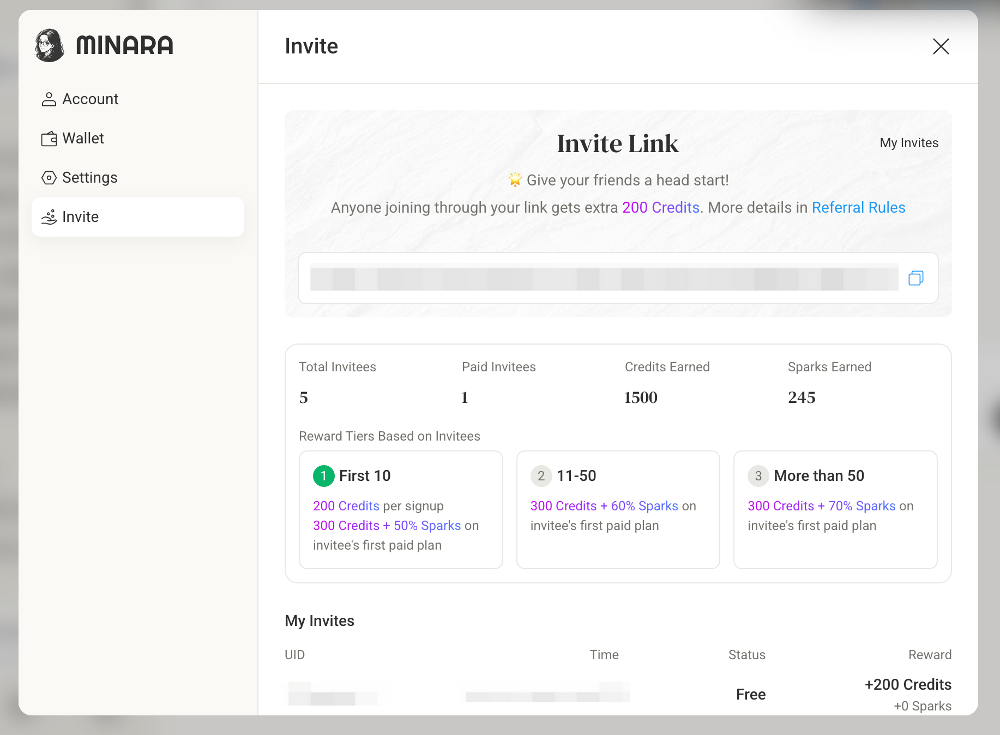

# Trading Copilot

Trading Copilot is an AI assistant that analyzes market conditions and generates structured trade signals for perpetual trading on Hyperliquid. You review the signal — entry price, take-profit, and stop-loss — and execute with one click. You remain in control of every trade.

Access Trading Copilot at: [copilot.minara.ai](https://copilot.minara.ai)

***

## 1. How Copilot generates signals

When you click **Ask Long** or **Ask Short**, Copilot evaluates the following inputs and produces a structured trade plan:

**Market structure and price action**

- Multi-timeframe candlestick data matched to your selected trading style
- Trend direction, volatility structure, key price levels
- Technical indicators: EMA, RSI, MACD

**Order book and liquidity**

- Real-time order book depth
- Bid/ask imbalance and recent trade flow

**Derivatives market signals**

- Funding rate history and direction
- Open interest changes
- Positioning dynamics from derivatives data

**Risk filtering**

Before presenting a signal, Copilot filters out setups with unfavorable risk-to-reward ratios, insufficient stop-loss buffers, or structurally invalid risk parameters.

The output includes:

- Trade direction: Long, Short, or Neutral
- Suggested entry price, take-profit (TP), and stop-loss (SL)
- Brief explanation of the signal rationale

<figure><figcaption></figcaption></figure>

***

## 2. Signal parameters you control

**Trading style** — determines the timeframe Copilot focuses on:

- `Scalping` — 3-minute chart, short in-and-out trades
- `Day` — 15-minute chart, same-day entries and exits
- `Swing` — 4-hour chart, positions held days to weeks

**Strategy** — determines the type of setup Copilot looks for:

- `Max Gain` — high reward-to-risk setups with strong backtest upside; fewer trades, larger moves
- `Max Win Rate` _(coming soon)_ — higher-probability setups with more flexible entry conditions

**Initial margin** — your default margin amount for quick orders. Does not affect signal output.

***

## 3. Infrastructure

Minara does not provide liquidity or act as a counterparty. All perpetual trades execute on Hyperliquid. Pricing, leverage, funding rates, and liquidity are fully Hyperliquid's. Minara is the AI interface and execution layer on top.

***

## 4. Deposit and transfer funds

Before trading, you need funds in your Minara Perps Wallet. Direct deposits to the Perps Wallet are not yet supported — you must go through the Spot Wallet first.

**Step 1: Deposit into your Minara Spot Wallet**

<figure><figcaption></figcaption></figure>

**Step 2: Transfer from Spot Wallet to Perps Wallet**

<figure><figcaption></figcaption></figure>

**Transfer rules:**

- Minimum transfer into Perps Wallet: 10 USDT
- Minimum transfer out of Perps Wallet: more than 1 USDT
- Hyperliquid charges a 1 USDT fee on withdrawals from the Perps Wallet
- Network fees apply on transfer (on-chain transaction)

***

## 5. Executing a trade

Once Copilot generates a signal, it pre-fills a limit order with the suggested entry, take-profit, and stop-loss. Before confirming, you can adjust:

- Leverage
- Initial margin

Place the order with one click. Manual market and limit orders are also available for advanced users.

***

## 6. Managing open positions

**Close all positions** — closes all open positions at market price (requires confirmation).

**Manual close** — close individual positions via market or limit order.

**Set take-profit and stop-loss on open positions:**

Go to Trade > Positions, select a position, and click "Add":

<figure><figcaption></figcaption></figure>

Set TP and/or SL values, optionally add split targets, then confirm:

<figure><figcaption></figcaption></figure>

Your take-profit and stop-loss are now active on the position:

<figure><figcaption></figcaption></figure>

Realized PnL updates immediately after execution.

***

## 7. Open order management

You can cancel individual pending orders or use **Cancel All Orders** to clear everything at once.

***

## 8. Margin mode

Copilot supports both margin modes provided by Hyperliquid:

- `Cross margin` — all positions share the same margin balance
- `Isolated margin` — margin is isolated per position

Switch margin modes directly in the trading interface.
