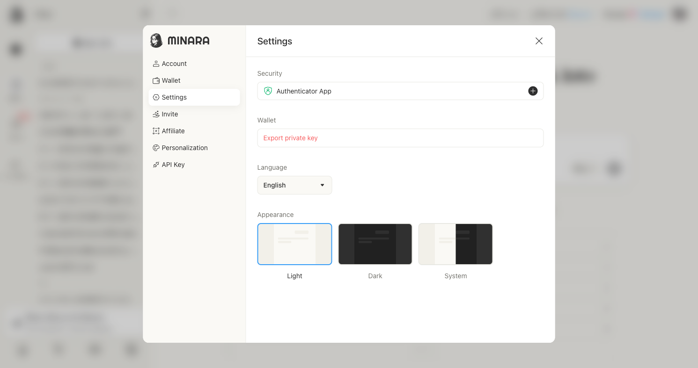
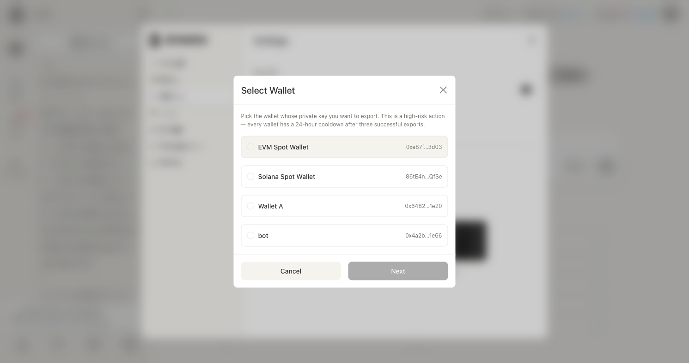
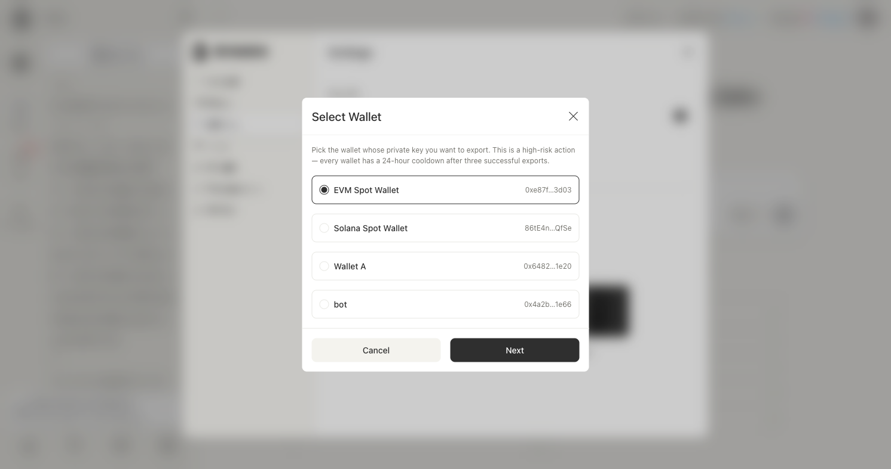
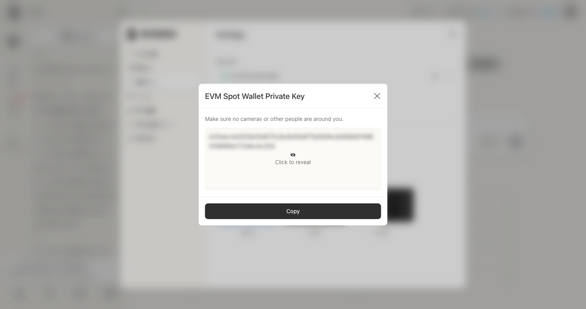

# Export your private key

Exporting your private key lets you import your Minara wallet into any compatible external wallet (MetaMask, Rabby, etc.) or recover it independently.


Your private key gives full control over your wallet. Never share it with anyone. Minara support will never ask for it. Each wallet allows a maximum of three successful exports in any 24-hour window.


## 1. Open Settings

Click your avatar in the top-right corner. In the left sidebar, select **Settings**.

Under the **Wallet** section, click **Export private key**.

<figure><figcaption></figcaption></figure>

## 2. Select a wallet

Choose the wallet whose private key you want to export. Minara may hold multiple wallets — EVM Spot Wallet, Solana Spot Wallet, and any additional wallets you have created.

<figure><figcaption></figcaption></figure>

Click the wallet to select it, then click **Next**.

<figure><figcaption></figcaption></figure>

## 3. Enable Authenticator App (first time only)

If you have not yet set up two-factor authentication on your account, Minara prompts you to do so before proceeding. You will see a QR code and a manual setup code.

Open your authenticator app (Google Authenticator, Authy, or any TOTP-compatible app), scan the QR code, and click **Next**.


This step only appears once. After your authenticator app is linked, future exports skip directly to the verification step.


## 4. Enter your verification code

Enter the 6-digit code currently shown in your authenticator app. The code refreshes every 30 seconds — if it expires, wait for the next one.

## 5. Copy your private key

Your private key is shown but hidden by default. Make sure no one is looking at your screen, then click **Click to reveal**.

<figure><figcaption></figcaption></figure>

Click **Copy** to copy the key to your clipboard. Store it somewhere secure — a password manager or encrypted storage. Do not save it in plain text.

Once you close this dialog, the key is no longer accessible through this screen. You can export again (up to three times per 24 hours) if needed.
