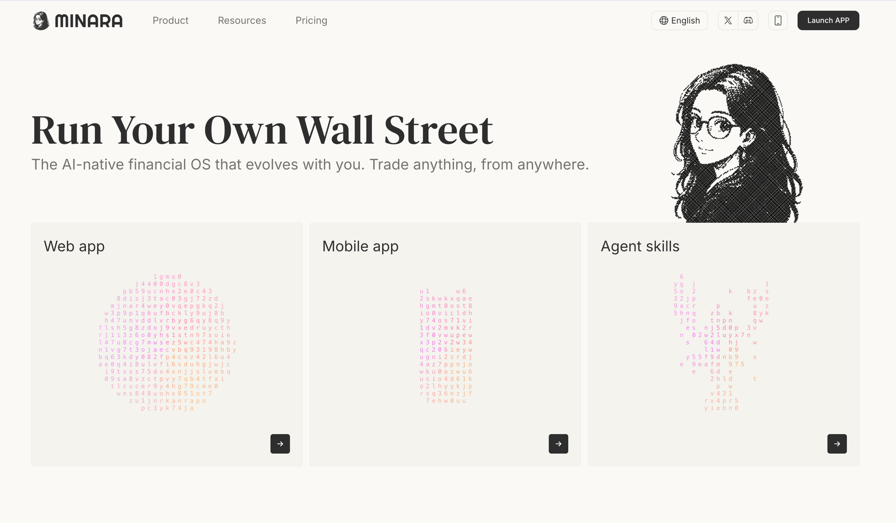
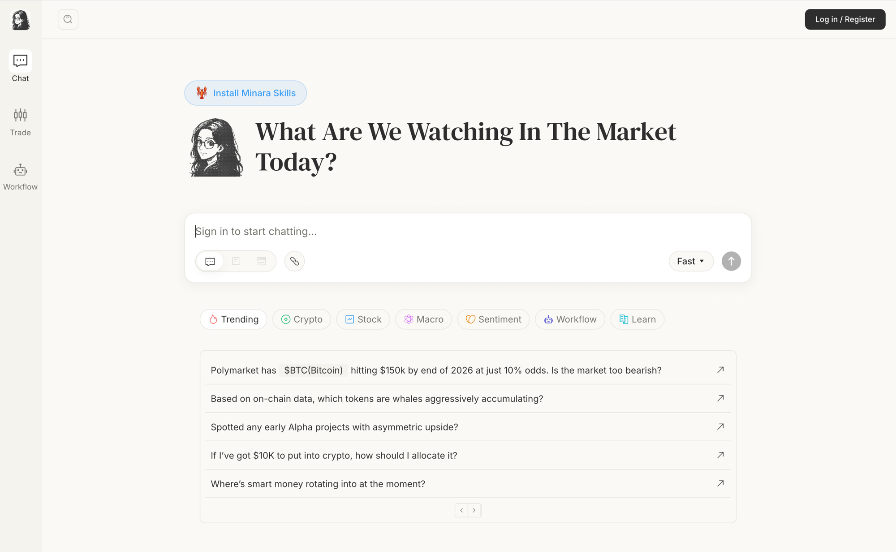

# Create your account

There are two ways to get to the sign-up screen. Use either one.

## 1. Open the app

**From the homepage.** Go to [minara.ai](https://minara.ai) and click `Launch APP` in the top-right corner.

<figure><figcaption></figcaption></figure>

**Or, from the chat page directly.** If you land on [app.minara.ai](https://app.minara.ai) without an account, click `Log in / Register` in the top-right corner.

<figure><figcaption></figcaption></figure>

## 2. Sign up with Google or email

In the sign-up dialog you have two options. Click `Continue with Google` to sign in with your Google account in one click. Or click `Continue with email`, enter your address, and type the verification code you receive to finish creating the account.

Once your account is created you land in the chat interface. Your spot wallet and perps wallets are created automatically; you do not need to set them up manually.

## Next steps

- [Deposit funds](../managing-funds-and-trading/how-to-deposit-funds.md) to start trading.
- [Perps wallets](../managing-funds-and-trading/perps-wallets.md): manage Lighter and Hyperliquid wallets.
