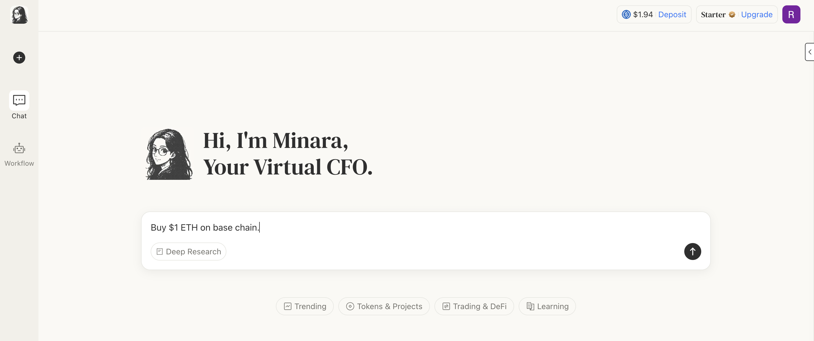

# Cryptocurrency




USDC is the base currency for all trades. If you haven't deposited yet, see [how-to-deposit-funds.md](../how-to-deposit-funds.md "mention").


## Via token detail

**1. Log in to Minara**

Visit Minara and log in to your account.

**2. Open token detail**

In the token list sidebar (which appears when tokens are mentioned in the chat), select the token you want to trade and click **"View Detail."**

<figure><figcaption></figcaption></figure>

**3. Set up your trade**

Enter the amount you wish to trade. Unfold the "Receive Amount" section to review estimated fees. You can also adjust slippage tolerance in settings.

<figure><figcaption></figcaption></figure>

**4. Confirm and execute**

Review the estimated rate and network fees, then click **"Buy"** to execute.

> _The same process applies to "Sell."_

## Via prompt

**1. Log in to Minara**

Visit Minara and log in to your account.

**2. Type your request in the chat**

<figure><figcaption></figcaption></figure>

**3. Confirm with one click**

Minara generates an interactive plugin in her response. Click **"Yes"** to proceed — no extra setup required.

<figure><figcaption></figcaption></figure>
