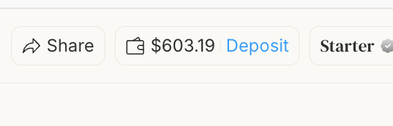
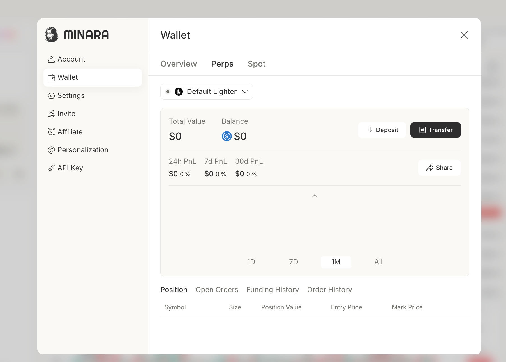

# Deposit

Minara supports two perpetuals exchanges, Lighter and Hyperliquid. Each perps wallet you create is bound to one of the two exchanges. This page covers everything you do with those wallets: depositing funds, transferring between wallets, withdrawing to an external address, and managing the wallets themselves.

## Deposit

The perps wallet accepts USDC deposits via Arbitrum. Deposits from other networks or tokens are not credited to the wallet and must be recovered by exporting the wallet's private key.

### 1. Create a wallet


You may skip this step if a wallet already exists. By default, your account has one wallet on each exchange, currently Lighter and Hyperliquid.


Click your avatar and select `Wallet`. In the `Perps` tab, click the wallet name dropdown and select `+ Add Wallet`.

<figure><figcaption></figcaption></figure>

In the `Create Wallet` dialog, select the trading platform (`Lighter` or `HyperLiquid`). Enter a name (max 20 characters, no special characters) and click `Continue`.

<figure><figcaption></figcaption></figure>

### 2. Copy your wallet address

Once the wallet is created, the address appears on the confirmation screen. Click `Copy` to save it. From here you can go to `Transfer` to move funds from another Minara wallet, or click `Deposit` to send from an external wallet.

<figure><figcaption></figcaption></figure>

### 3. Deposit USDC via Arbitrum

Click `Deposit` to open the deposit screen. Scan the QR code or copy the deposit address, then send USDC from your external wallet.


The perps wallet only accepts USDC via Arbitrum. Deposits from other networks or tokens may not appear in the app and must be recovered by exporting your private key.


<figure><figcaption></figcaption></figure>

## Transfer

You can move funds between any two of your Minara perps wallets.

### 1. Open the wallet panel

Click the wallet icon in the top bar.

<figure><figcaption></figcaption></figure>

### 2. Open the Perps tab and click Transfer

In the `Wallet` panel, switch to the `Perps` tab, pick a wallet from the dropdown, and click `Transfer`.

<figure><figcaption></figcaption></figure>

### 3. Confirm the transfer

In the `Transfer` dialog, set `From` and `To` to the source and destination wallets. Pick the asset (`USDC` or `USDH`), enter the amount (or click `Max`), and click `Confirm`.

<figure><figcaption></figcaption></figure>

## Withdraw

To move USDC out of Minara entirely, open the `Transfer` dialog (steps 1–2 above) and click `Withdraw USDC to an external Arbitrum address` at the bottom. Enter the destination Arbitrum address and the amount, then confirm. The withdrawal is sent on the Arbitrum network in USDC.

<figure><figcaption></figcaption></figure>

<figure><figcaption></figcaption></figure>

Withdrawals from a Hyperliquid wallet incur a $1 fee deducted by Hyperliquid.

## Transfer between Lighter and Hyperliquid

Cross-exchange transfers use the same `Transfer` dialog as same-exchange transfers; set `From` and `To` to wallets on the two different exchanges. &#x20;

<figure><figcaption></figcaption></figure>

<figure><figcaption></figcaption></figure>


Cross-exchange transfers can take up to 15 minutes to complete. Hyperliquid deducts $1 from the transferred amount on its side. There is no Lighter-side fee.


## Switch wallets while trading

The wallet selector sits at the top-left of the Perps trading page. Click the wallet name to pick a different wallet for the next order, or click `+ Add Wallet` to create one without leaving the trading view.

The selected wallet determines the balance, available margin, leverage limits, and routing venue shown in the order panel on the right.

<figure><figcaption></figcaption></figure>

## Rename

Open the wallet panel from your avatar menu and go to the `Perps` tab. Click the pencil icon next to a wallet name in the dropdown.

Type the new name (max 20 characters, no special characters) and click `Confirm`. The new name applies everywhere the wallet appears, including the trading page selector.

<figure><figcaption></figcaption></figure>

## Notes

* Each wallet belongs to a single exchange. You cannot convert a Lighter wallet into a Hyperliquid wallet or vice versa; create a new wallet and transfer the funds.
* Lighter and Hyperliquid wallets use the same key model. The same [Wallet security](../../technology/wallet-security.md) rules apply to both.
