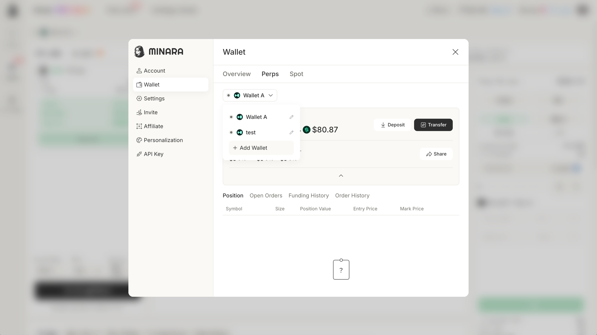
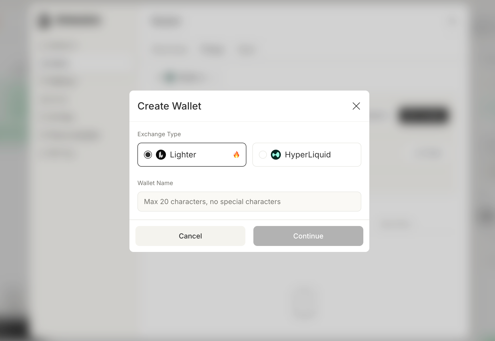
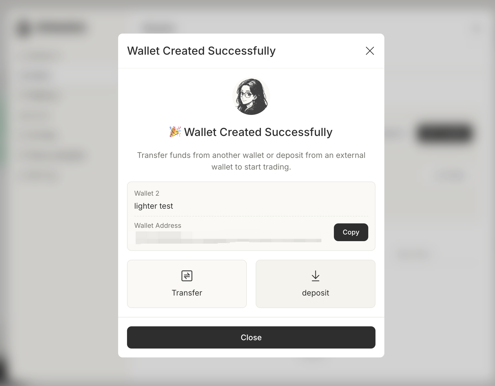
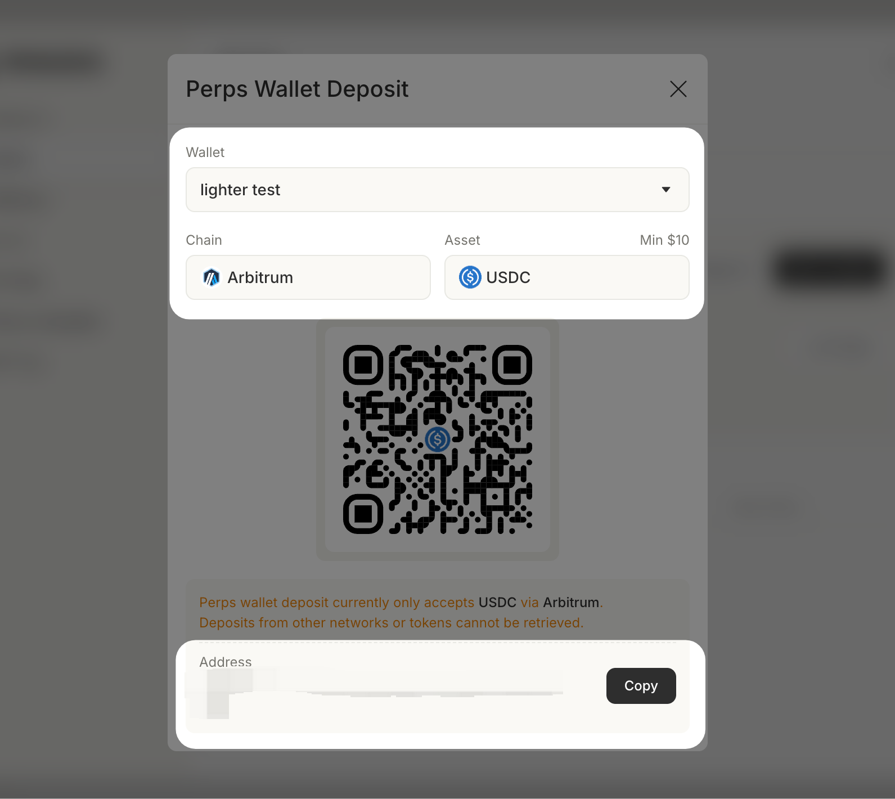
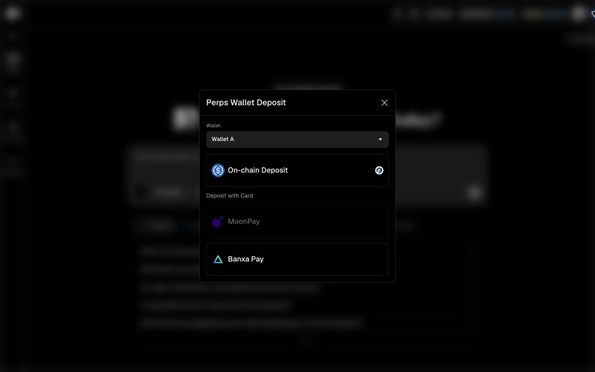
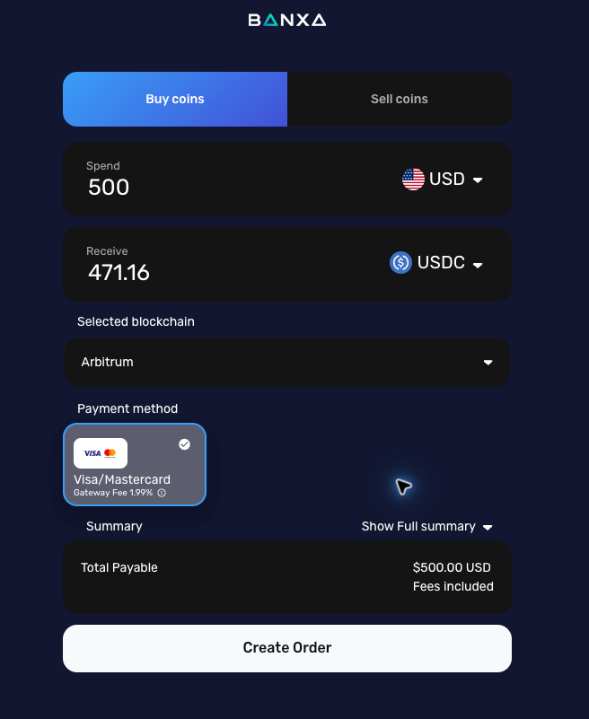
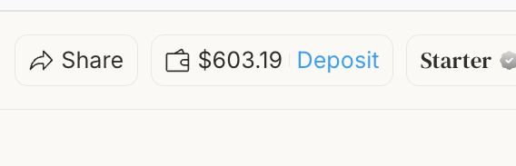
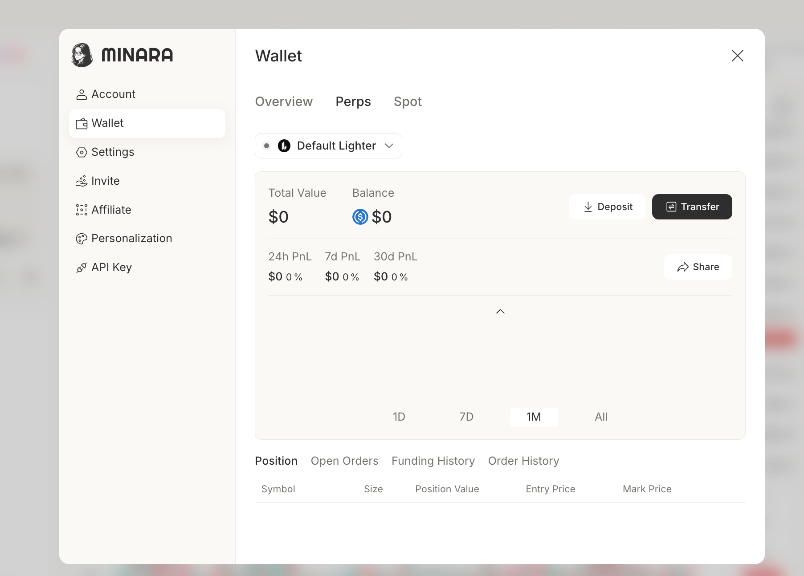
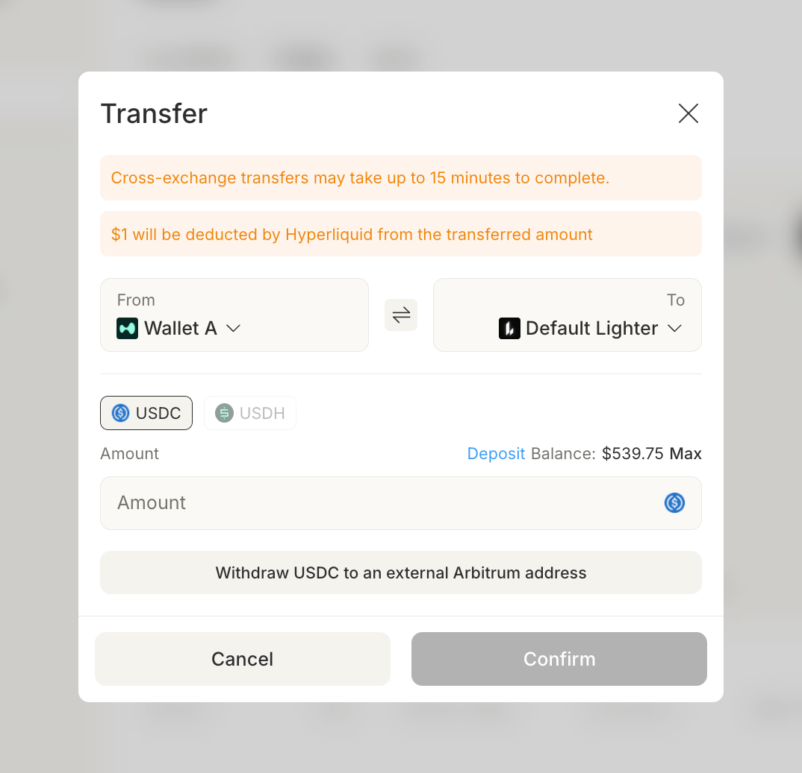

# Deposit

Minara supports two perpetuals exchanges, Lighter and Hyperliquid. Each perps wallet you create is bound to one of the two exchanges. This page covers everything you do with those wallets: depositing funds, transferring between wallets, withdrawing to an external address, and managing the wallets themselves.

## Deposit

The perps wallet accepts USDC deposits via Arbitrum. Deposits from other networks or tokens are not credited to the wallet and must be recovered by exporting the wallet's private key.

### 1. Create a wallet


You may skip this step if a wallet already exists. By default, your account has one wallet on each exchange, currently Lighter and Hyperliquid.


Click your avatar and select `Wallet`. In the `Perps` tab, click the wallet name dropdown and select `+ Add Wallet`.

<figure><figcaption></figcaption></figure>

In the `Create Wallet` dialog, select the trading platform (`Lighter` or `HyperLiquid`). Enter a name (max 20 characters, no special characters) and click `Continue`.

<figure><figcaption></figcaption></figure>

### 2. Copy your wallet address

Once the wallet is created, the address appears on the confirmation screen. Click `Copy` to save it. From here you can go to `Transfer` to move funds from another Minara wallet, or click `Deposit` to send from an external wallet.

<figure><figcaption></figcaption></figure>

### 3. Deposit USDC via Arbitrum

Click `Deposit` to open the deposit screen. Scan the QR code or copy the deposit address, then send USDC from your external wallet.


The perps wallet only accepts **USDC via Arbitrum**. Deposits from other networks or tokens may not appear in the app and must be recovered by exporting your private key.


<figure><figcaption></figcaption></figure>

## Buy USDC directly with MoonPay or Banxa Pay

If you do not already hold USDC, you can buy it with fiat through MoonPay or Banxa Pay and have it delivered directly to a selected Minara perps wallet. Minara automatically supplies the destination wallet address and sets the asset and network to USDC on Arbitrum.


MoonPay and Banxa Pay are third-party providers. Availability, payment methods, limits, fees, exchange rates, processing times, and KYC requirements vary by provider and region. MoonPay is disabled in regions where it is not available.

If you cannot use a provider in your country or region, check its current official availability list: [MoonPay's unsupported countries](https://support.moonpay.com/en/articles/380968-moonpay-s-unsupported-countries) or [countries supported by Banxa](https://support.banxa.com/en/support/solutions/articles/44002216505-what-countries-are-supported-by-banxa-). These lists are maintained by the providers and may change.

Minara does not process card payments or review KYC. For order or payment issues, contact [MoonPay Support](https://support.moonpay.com/) or [Banxa Support](https://support.banxa.com/).


### 1. Select a provider

Click `Deposit` in the top bar. In the `Perps Wallet Deposit` dialog, select the wallet you want to fund. Under `Deposit with Card`, choose `MoonPay` or `Banxa Pay`.

<figure><figcaption></figcaption></figure>

### 2. Complete a MoonPay order

Click `MoonPay`. On first use, review and accept the third-party service notice. A new MoonPay window opens with the destination wallet prepared for USDC on Arbitrum.

1. Select the fiat currency and enter the amount of USDC to buy.
2. Verify your email address.
3. Select a payment method and enter the required payment details.
4. Complete MoonPay's identity verification if prompted.
5. Review the quote, fees, destination asset, and network, then complete the payment.

After MoonPay completes the order, the purchased USDC is sent to the perps wallet you selected in Minara.


If the MoonPay option is disabled, MoonPay is not available in your current region. Check [MoonPay's official unsupported-country list](https://support.moonpay.com/en/articles/380968-moonpay-s-unsupported-countries), then use Banxa Pay or make an on-chain USDC deposit instead.


### 3. Complete a Banxa Pay order

Click `Banxa Pay`. A new Banxa window opens with USDC, Arbitrum, and the destination wallet address already selected.

1. Select the fiat currency and enter the amount to spend.
2. Confirm that `USDC` and `Arbitrum` are selected.
3. Choose a payment method and review the estimated USDC amount, fees, and total payable.
4. Click `Create Order`, then complete Banxa's identity verification and payment steps.

<figure><figcaption></figcaption></figure>

The amounts and fees in the image are examples only. Your live quote may differ.

### 4. Confirm the deposit

After the provider marks the order as complete, return to Minara and check the selected perps wallet. The USDC balance updates after the provider sends the funds and the Arbitrum transfer is confirmed. Keep the provider's order reference until the funds arrive.

## Transfer

You can move funds between any two of your Minara perps wallets.

### 1. Open the wallet panel

Click the wallet icon in the top bar.

<figure><figcaption></figcaption></figure>

### 2. Open the Perps tab and click Transfer

In the `Wallet` panel, switch to the `Perps` tab, pick a wallet from the dropdown, and click `Transfer`.

<figure><figcaption></figcaption></figure>

### 3. Confirm the transfer

In the `Transfer` dialog, set `From` and `To` to the source and destination wallets. Pick the asset (`USDC` or `USDH`), enter the amount (or click `Max`), and click `Confirm`.

<figure><figcaption></figcaption></figure>

## Withdraw

To move USDC out of Minara entirely, open the `Transfer` dialog (steps 1–2 above) and click `Withdraw USDC to an external Arbitrum address` at the bottom. Enter the destination Arbitrum address and the amount, then confirm. The withdrawal is sent on the Arbitrum network in USDC.

<figure><figcaption></figcaption></figure>

<figure><figcaption></figcaption></figure>

Withdrawals from a Hyperliquid wallet incur a $1 fee deducted by Hyperliquid.

## Transfer between Lighter and Hyperliquid

Cross-exchange transfers use the same `Transfer` dialog as same-exchange transfers; set `From` and `To` to wallets on the two different exchanges.

<figure><figcaption></figcaption></figure>

<figure><figcaption></figcaption></figure>


Cross-exchange transfers can take up to 15 minutes to complete.&#x20;

If you are transfering from Hyperliquid to Lighter: Hyperliquid deducts $1 from the transferred amount on its side.\
If you are transfering from Lighter to Hyperliquid: Lighter deducts $3 from the transferred amount on its side.


## Switch wallets while trading

The wallet selector sits at the top-left of the Perps trading page. Click the wallet name to pick a different wallet for the next order, or click `+ Add Wallet` to create one without leaving the trading view.

The selected wallet determines the balance, available margin, leverage limits, and routing venue shown in the order panel on the right.

<figure><figcaption></figcaption></figure>

## Rename

Open the wallet panel from your avatar menu and go to the `Perps` tab. Click the pencil icon next to a wallet name in the dropdown.

Type the new name (max 20 characters, no special characters) and click `Confirm`. The new name applies everywhere the wallet appears, including the trading page selector.

<figure><figcaption></figcaption></figure>

## Notes

* Each wallet belongs to a single exchange. You cannot convert a Lighter wallet into a Hyperliquid wallet or vice versa; create a new wallet and transfer the funds.
* Lighter and Hyperliquid wallets use the same key model. The same [Wallet security](../../technology/wallet-security.md) rules apply to both.
