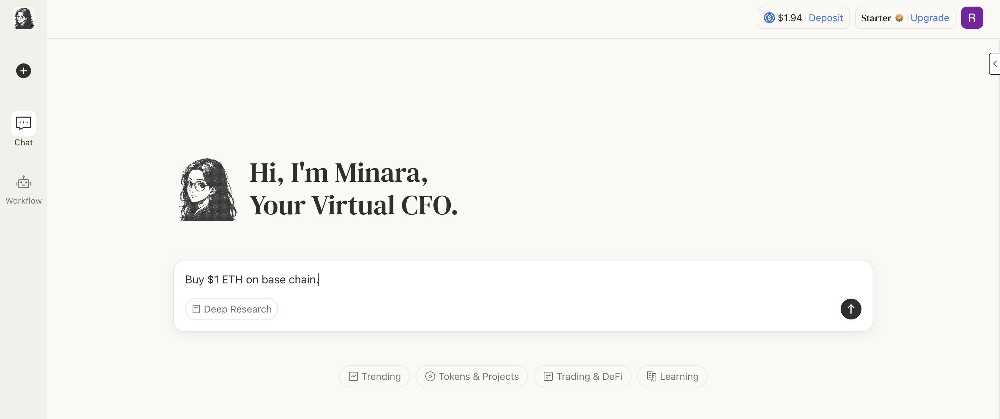

# How to buy cryptocurrency?



## Get Ready: Deposit Funds

If you don’t know how to deposit USDC, check this guide: [how-to-deposit-funds.md](how-to-deposit-funds.md "mention"). Please note that USDC is used as the base currency for trading.

## Buy & Sell via Token Detail

### **1. Log in to Minara**

Visit Minara and log in to your account.

### **2. Open Token Detail**

In the token list sidebar (which appears when tokens are mentioned in the chat), select the token you want to buy or sell and click **“View Detail.”**

<figure><figcaption></figcaption></figure>

### **3. Set Up Your Trade**

Enter the amount you wish to trade. You can review the estimated fees by unfolding the “Receive Amount” section. You may also adjust the slippage tolerance in settings.

<figure><figcaption></figcaption></figure>

### **4. Confirm the Action to Complete**

After reviewing the estimated rate and network fees, click **“Buy”** to execute the trade.

> _The same process applies to "Sell"._

## Buy & Sell via Prompt

### **1. Log in to Minara**

Visit Minara and log in to your account.

### **2. Type Your Request in the Chat**

<figure><figcaption></figcaption></figure>

### **3. Confirm with One Click**

Minara will generate an interactive plugin in her response.You can now proceed simply by clicking **“Yes”**—no extra setup or selections required.

<figure><figcaption></figcaption></figure>

That’s it! You’re all set to start buying crypto with Minara.
