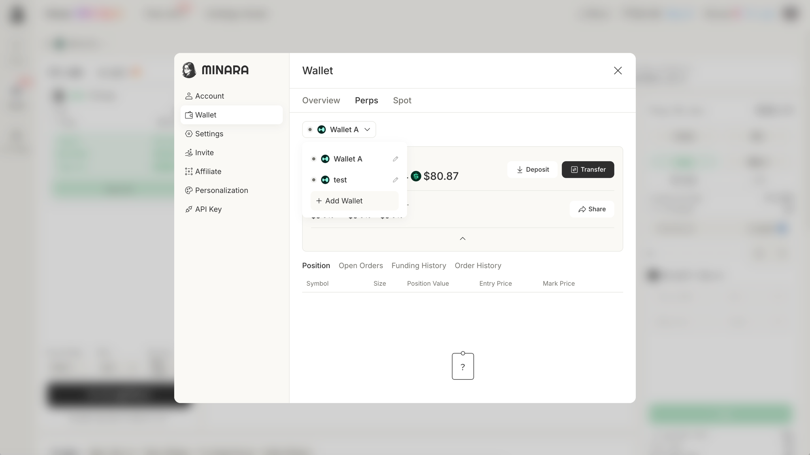
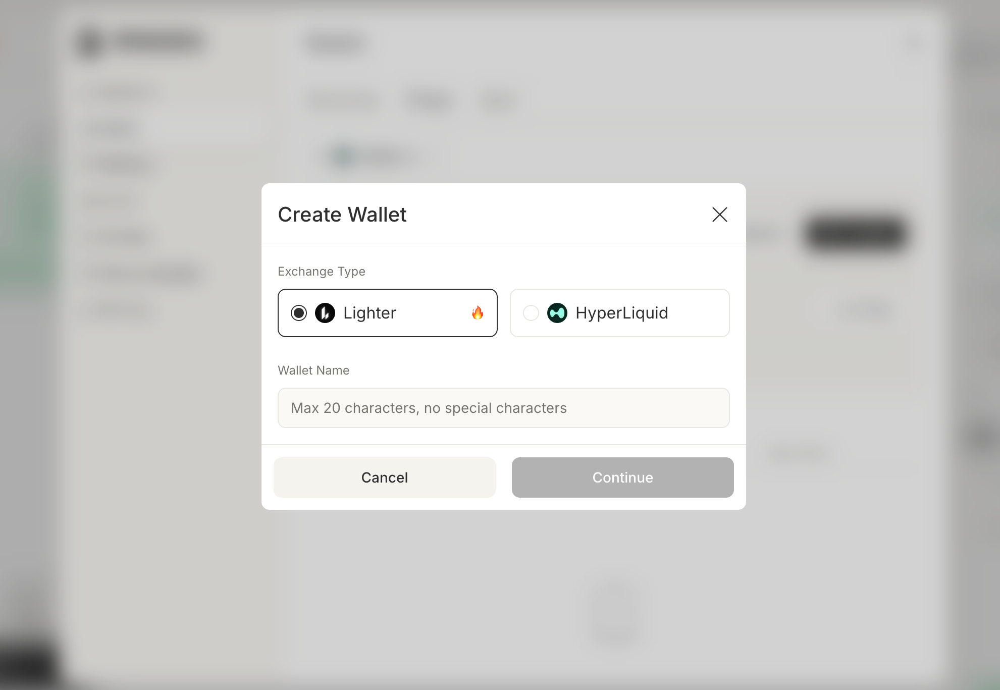
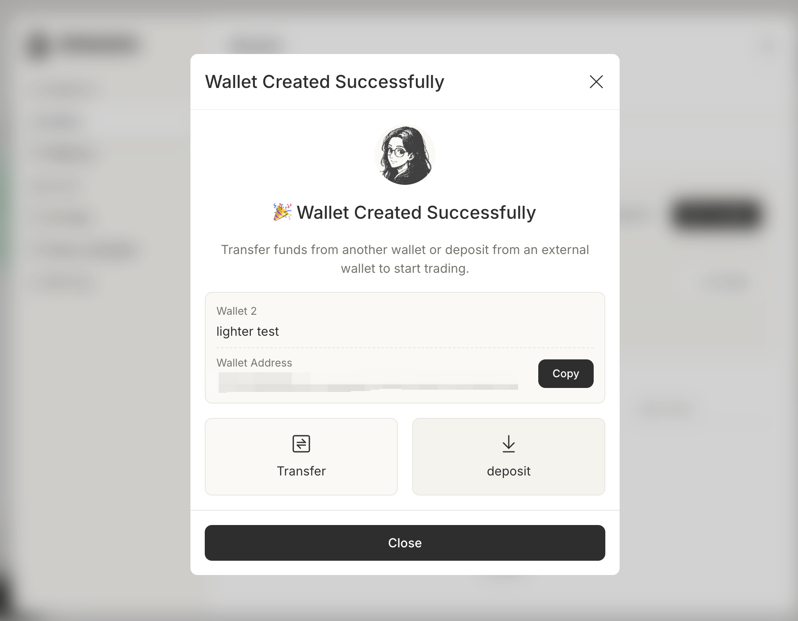
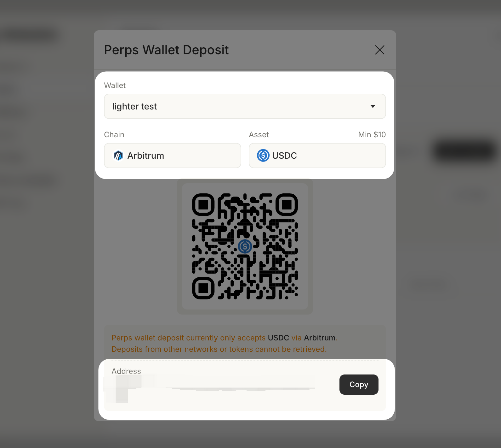

# Deposit funds

This guide will show you how to deposit **USDC** in three different ways: using a credit card, withdrawing from a CEX, or transferring from another crypto wallet.



## Deposit with a credit card

⚠️ _Note: Minara does not operate these services (deposit with a credit card)_ and isn’t able to step in on their behalf. _We only aggregate third-party OTC providers._

### Deposit via Alchemy Pay

#### 1. Select Alchemy Pay

First, click on the **Deposit** button at the top right, then select **Alchemy Pay**.

<figure><figcaption></figcaption></figure>

#### 2. Select Fiat and Input Amount

Select the fiat currency you wish to pay with, then input the amount of USDC you wish to buy.

<figure><figcaption></figcaption></figure>

#### 3. Confirm Email

Confirm your Email Address and enter the verification code sent to your email.

<figure><figcaption></figcaption></figure>

#### 4. Fill in Payment Method and KYC

Choose your payment method, input your credit card or Google Pay information, and complete KYC. Once verified and the payment is completed, you will receive your tokens.

| Choose Payment Method                                                     | Fill in Information                                                       | KYC                                                                       |
| ------------------------------------------------------------------------- | ------------------------------------------------------------------------- | ------------------------------------------------------------------------- |
|  |  |  |

If you have any questions, please contact Alchemy Pay support: https://ramp.alchemypay.org/

***

### Deposit via Banxa Pay

#### 1. Select Banxa Pay

First, click on the **Deposit** button at the top right, then select **Banxa Pay**.

<figure><figcaption></figcaption></figure>

#### 2. Select Fiat and Input Amount

Select the fiat currency you wish to pay with. In the red box, input the amount and token you wish to buy (e.g., USDC), and select Solona chain.

<figure><figcaption></figcaption></figure>

3. **KYC and Pay**

Then, fill out your personal details for KYC. After verification and payment, you will receive your tokens.

| KYC Step 1                                                                | KYC Step 2                                                                | KYC Step 3                                                                |
| ------------------------------------------------------------------------- | ------------------------------------------------------------------------- | ------------------------------------------------------------------------- |
|  |  |  |

If you have any questions, please contact Banxa Pay support: https://support.banxa.com/en/support

***

## Deposit from CEXs

#### **1. Prepare Your Exchange Account**

Log in to your CEX account (e.g., Binance, OKX, Coinbase) and ensure you have the crypto asset you want to transfer.

#### **2. Click "Deposit" button**

Visit Minara and log in to your account. Click the **“Deposit”** button at the top right corner, and select "On-chain Deposit".

<figure><figcaption></figcaption></figure>

**3. Choose Token and Network**

Select the blockchain network you want to use for the deposit. Minara will generate a wallet address for the selected network.

<figure><figcaption></figcaption></figure>

#### **4. Withdraw from the CEX**

Go to your exchange's **Withdraw/Send** section.

* Paste the deposit address from Minara
* Select the same token and network as shown on Minara
* Enter the amount and confirm the withdrawal

Once the transaction is confirmed on-chain, your funds will appear in your Minara account.

***

## Deposit from another crypto wallet to your Spot Wallet


Please note that deposit to Minara spot wallet is currently unavailable as the spot wallet service is under maintenance.


#### **1. Prepare Your Wallet**

Make sure you have an external crypto wallet with sufficient funds and access to the correct blockchain network.

#### **2. Click "Deposit" button**

Visit Minara and log in to your account. Click the **“Deposit”** button at the top right corner, and select "On-chain Deposit".

<figure><figcaption></figcaption></figure>

**3. Select the Token and Network**

Choose the token you want to deposit (e.g., USDC, ETH) and the corresponding blockchain network (e.g., Ethereum, Arbitrum, BNB Chain).

<figure><figcaption></figcaption></figure>

#### **4. Send the Funds**

Copy the deposit address provided by Minara and send the tokens from your wallet.

* Double-check the token type and network
* Confirm the transaction in your wallet
* Wait for on-chain confirmation (usually a few minutes)

**Once confirmed, your balance will be updated in Minara.**

***

## Deposit to Perps Wallet

Minara now supports Lighter and HyperLiquid. You can create a wallet for Lighter or Hyperliquid and fund it directly from the Wallet panel.

#### 1. Create wallet


You may skip this step if the wallet has already been created. By default, each trading platform has one wallet created, currently Lighter and Hyperliquid.


Click your avatar and select `Wallet`. In the `Perps` tab, click the wallet name dropdown and select `+ Add Wallet`. &#x20;

<figure><figcaption></figcaption></figure>

In the `Create Wallet` dialog, select the trading platform. Enter a name (max 20 characters, no special characters) and click `Continue`.

<figure><figcaption></figcaption></figure>

#### 3. Copy your wallet address

Once the wallet is created, your wallet address appears on the confirmation screen. Click `Copy` to save it. From here you can go to `Transfer` to move funds from another Minara wallet, or click `deposit` to send from an external wallet.

<figure><figcaption></figcaption></figure>

#### 4. Deposit USDC via Arbitrum

Click `deposit` to open the deposit screen. Scan the QR code or copy the deposit address, then send USDC from your external wallet.


The Perps wallet currently only supports USDC deposits via Arbitrum. Deposits from other networks or tokens may not appear in the app and must be managed by exporting your private key.


<figure><figcaption></figcaption></figure>
