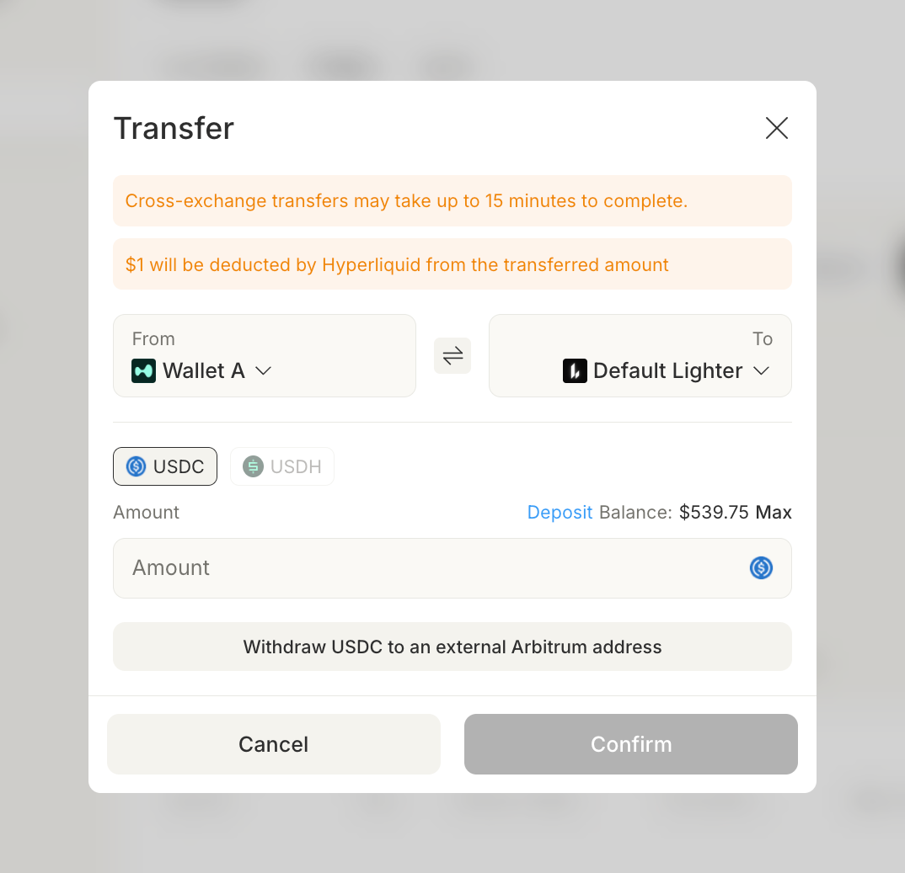

# Perps wallets

Minara supports two perpetuals exchanges: \[Lighter]\([https://lighter.xyz/](https://lighter.xyz/)) and \[Hyperliquid]\([https://app.hyperliquid.xyz/trade](https://app.hyperliquid.xyz/trade)). You can hold multiple perps wallets under one account, with each wallet bound to one of the two exchanges. Funds can be moved between wallets, including across exchanges.

For first-time setup (creating a wallet, depositing USDC), see [Deposit funds](how-to-deposit-funds.md#deposit-to-perps-wallet). This page covers the rest: renaming wallets, transferring between Lighter and Hyperliquid, and switching wallets while trading.&#x20;

## Rename a wallet

Open the wallet panel from your avatar menu and go to the `Perps` tab. Click the pencil icon next to a wallet name in the dropdown.&#x20;

<figure><figcaption></figcaption></figure>

<figure><figcaption></figcaption></figure>

Type the new name (max 20 characters, no special characters) and click `Confirm`. The new name applies everywhere the wallet appears, including the trading page selector.

## Transfer between Lighter and Hyperliquid

You can move USDC (and USDH where supported) between any two perps wallets, including across exchanges.


Cross-exchange transfers can take up to 15 minutes to complete. Hyperliquid deducts $1 from the transferred amount on its side.


### 1. Open the wallet panel

Click the wallet icon in the top bar.

<figure><figcaption></figcaption></figure>

### 2. Open the Perps tab and click Transfer

In the `Wallet` panel, switch to the `Perps` tab, pick the destination wallet from the dropdown, and click `Transfer`.

<figure><figcaption></figcaption></figure>

### 3. Confirm the transfer

In the `Transfer` dialog, set `From` and `To` to the source and destination wallets. Pick the asset (`USDC` or `USDH`), enter the amount (or click `Max`), and click `Confirm`.

<figure><figcaption></figcaption></figure>

The dialog also shows a `Withdraw USDC to an external Arbitrum address` link if you want to move funds out of Minara entirely.

## Switch wallets while trading

The wallet selector sits at the top-left of the Perps trading page. Click the wallet name to pick a different wallet for the next order, or click `+ Add Wallet` to create one without leaving the trading view.&#x20;

<figure><figcaption></figcaption></figure>

The selected wallet drives the order panel on the right: balance, available margin, leverage limits, and the venue your order routes to all come from that wallet.

## Notes

* Each wallet belongs to a single exchange. You cannot convert a Lighter wallet into a Hyperliquid wallet or vice versa; create a new wallet and transfer the funds.
* By default, your account has one wallet on each exchange. You can add more at any time.
* Lighter and Hyperliquid wallets use the same key model. The same [Wallet security](../../technology/wallet-security.md) rules apply to both.
