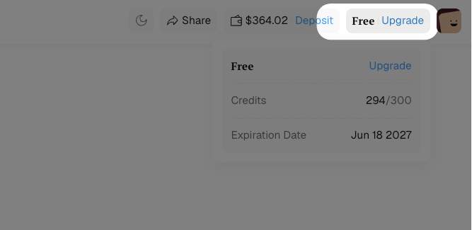
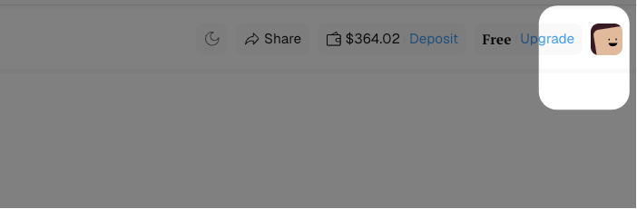
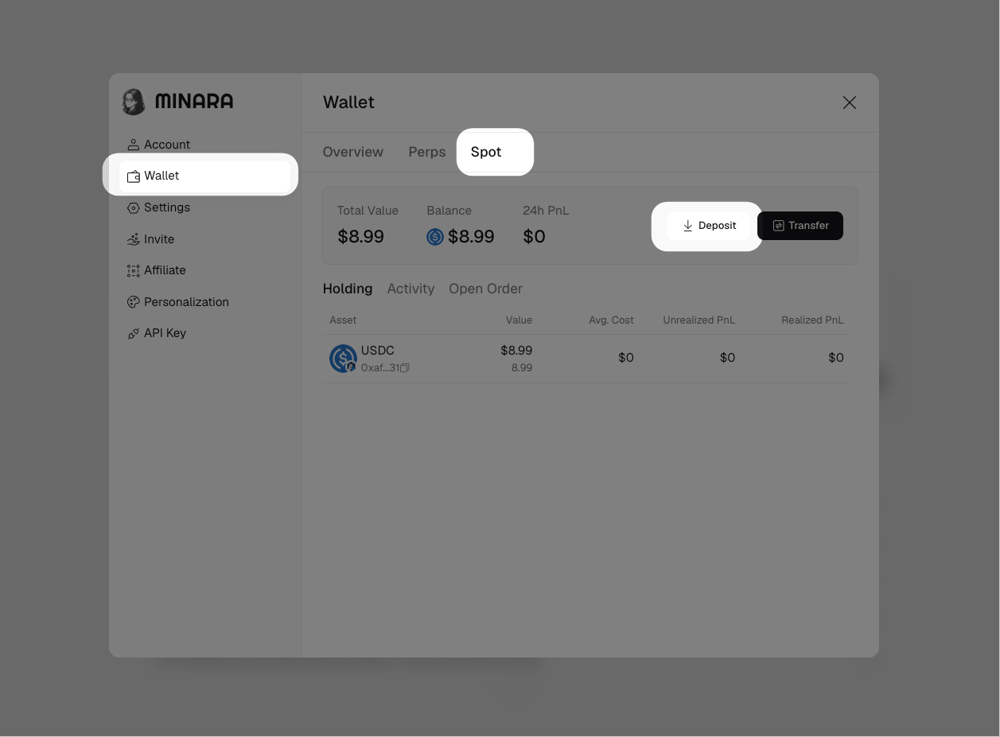
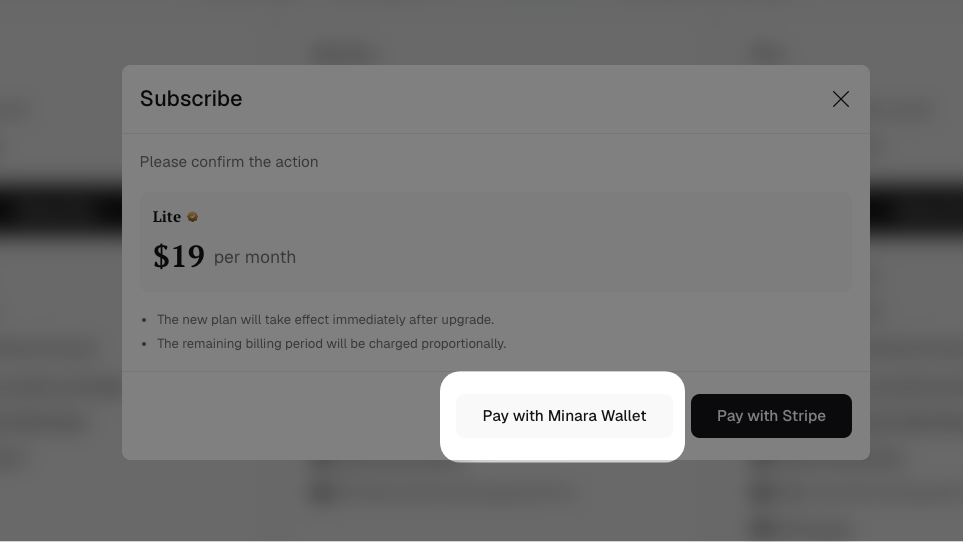
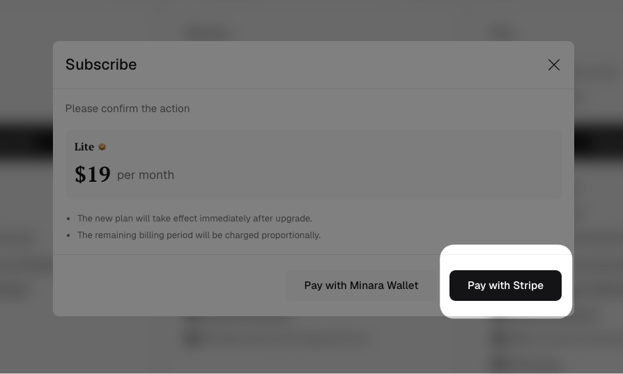

# Subscribe

A paid plan raises your credit limit, unlocks more active workflows, and gives you the full feature set. See [Credits](../../reference/credits.md) for what each plan includes and how credits are metered.

You can pay two ways: with crypto from your Minara Spot wallet, or with a card through Stripe. Both start from the same plan picker.

## Choose a plan

Click the plan label or `Upgrade` in the top bar.

<figure><figcaption></figcaption></figure>

In the `Manage` dialog, switch between `Individual` and `Business`, toggle `Pay annually` if you want annual billing, and click `Subscribe` on the plan you want.

<figure><figcaption></figcaption></figure>

A confirmation dialog opens with the plan and price. Pick a payment method: `Pay with Minara Wallet` (crypto) or `Pay with Stripe` (card). The plan takes effect immediately, and Minara prorates the charge for the rest of the current billing period.

## Pay with crypto (Minara Wallet)

Crypto subscriptions are charged from your **Spot** wallet balance, not your Perps wallet. Fund the Spot wallet before you subscribe.

### 1. Deposit USDC to your Spot wallet

Click your avatar, select `Wallet`, and open the `Spot` tab. Click `Deposit`.

<figure><figcaption></figcaption></figure>

Select a chain and send USDC to the address shown. Scan the QR code or click `Copy` to get the address.


For subscription payments, deposit USDC on a non-EVM chain. We recommend **Solana**. Deposits can take around 15 minutes to credit your Spot wallet.


<figure><figcaption></figcaption></figure>

<figure><figcaption></figcaption></figure>

### 2. Pay with your wallet balance&#x20;

Once the deposit lands, open the plan picker again, click `Subscribe` on your plan, and choose `Pay with Minara Wallet`. Review the amount and the payment execution cost, then click `Confirm`.

<figure><figcaption></figcaption></figure>


`Insufficient Payable Balance` means your Spot wallet does not hold enough USDC. Deposit more, or wait for a pending deposit to credit, then try again.


## Pay with card (Stripe)

In the confirmation dialog, click `Pay with Stripe` and complete the card checkout. You do not need to fund a wallet to pay by card.

<figure><figcaption></figcaption></figure>
