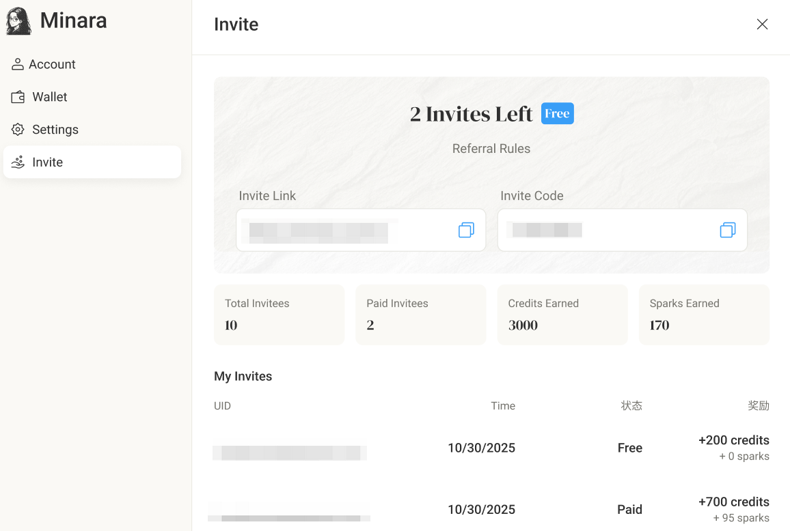

# Referral & Rewards

### How It Works

1. **Get your invite link and code**\
   You’ll find them in the **Invites** section of your profile.\
   Each user has a unique link and 6-digit code.
2. **Share with friends**\
   Send your link or code to people who haven’t joined Minara yet.\
   When they activate their account using your invite, it counts as a successful referral.

> Definition of "Activate": 
>
> When the registered user successfully enters a valid **invite code** or uses an valid **invite link** to activate their account.\
> Activation officially links the invitee to the inviter and unlocks rewards.
>
> .png>)

* **Earn rewards**\
  You receive **Credits and Sparks** automatically base on the action of your invitees. (See “Reward Details” below for more details.)
* **Track your progress**\
  See your total invites, paid conversions, and rewards at a glance in your **Profile** - **Invites**.



<figure><figcaption></figcaption></figure>



<figure><figcaption></figcaption></figure>



***

### Reward Details

| Action                                         | Inviter Gets                                   | Invitee Gets                                    |
| ---------------------------------------------- | ---------------------------------------------- | ----------------------------------------------- |
| When invitee activates their account           | 200 Credits                                    | 200 credits                                     |
| When invitee paid for their first subscription | 500 Credits + 50% Sparks that invitee receives | Full Sparks bonus based on their plan as normal |

> _Credits_ can be used across Minara’s features. Learn more about credits in [how-credits-work.md](subscription-and-credits/how-credits-work.md "mention") \
> &#xNAN;_&#x53;parks_ are special bonuses for limited events. Check out [spark.md](features/spark.md "mention") for more details

***

### Invite Quota

#### **Contributor Invite Campaign**&#x20;

The **Contributor Invite Campaign** allows active users to receive additional invite quotas through participation and contribution within the Minara ecosystem. These invites are manually granted by the Minara team based on community engagement and contribution quality.

**Campaign Details**

Eligible users may receive **extra invite quotas** through the following activities:

1. **Engaging actively with Minara:** Explore features, provide insights, and interact regularly.
2. **Sharing feedback and suggestions:** Participate in discussions on Minara Discord server and share ideas and suggestions with the team.
3. **Spreading Minara use cases:** Share your own workflows, prompts, analyses, or any use cases that you find helpful on social medias.

All community-based invites are **reviewed and granted manually** by the Minara team.&#x20;


For more information, please reach out to the team on our Discord.


#### Get Invite Quotas by Subscription

* You receive **invite quota upon successful subscription payment**, including actions of **subscribe, upgrade, or renew**.
* **Upgrade :** When you upgrade to a higher plan, you receive the quota difference between the new plan and the previous plan.&#x20;
* **Renew**: When your plan renews, you receive the same quota as subscription.&#x20;

Once your quota is used up, new users can’t activate with your code until you purchase, upgrade, or renew a plan again.

> Existing paid subscribers will be granted invite quotas according to their plan. “Existing” refers to users who paid before the referral feature goes live.

**Invite Quota by Plan:**

<table><thead><tr><th width="166.0234375">Plan</th><th width="148.1640625">Invite Quota</th><th>Note</th></tr></thead><tbody><tr><td>Free</td><td>0</td><td>Free users currently can’t invite (<em>Invite quotas coming soon</em>).</td></tr><tr><td>Lite (Monthly)</td><td>5</td><td>Annual plan subscribers get 3x5 = 15 </td></tr><tr><td>Starter (Monthly)</td><td>10</td><td>Annual plan subscribers get 3x10 = 30 </td></tr><tr><td>Pro (Monthly)</td><td>15</td><td>Annual plan subscribers get 3x15 = 45 </td></tr><tr><td>Partner (Monthly)</td><td>20</td><td>Annual plan subscribers get 3x20 = 60 </td></tr></tbody></table>

***

### 💬 FAQs

**Q1. Why can’t my friend join with my code?**\
You may have used all your invite slots. Upgrade your plan to get more.

**Q2. Why can’t I invite yet?**\
Please double check your plan. Free plans don’t include invites for now. If you have paid and not received any invite quota, please submit a ticket in our Discord.

**Q3. What’s the difference between Register and Activate?**\
Registration creates an account. Activation confirms it with an available invite code and triggers rewards.

**Q4. Do I keep my rewards?**\
Yes. Earned Credits and Sparks remain in your account.

**Q5. How is the Sparks bonus split?**\
Your friend receives the full Sparks bonus based on their plan (as normal), and you receive 50 % of the amount they receive.

**Q6. I had paid subscription but it expired. Do I still get invites?**\
We have granted invites to subscribers by the time the referral feature is launched. However, if your subscription had expired before that, you won't receive any invite.

**Q7. Do reward credits expire?**

Reward credits do not expire. Credits are used in the following order whenever you spend them:

1. **Plan Credits** – your plan credits that refresh every month;
2. **Reward Credits** – credits you earn from referral rewards;
3. **Top-up Credits** – credits you purchase manually as add-ons.

**Q8. I invited a new user, but my invite quota was full. Will I still get rewards if they activate later?**\
No. Rewards are only granted **when the invitee successfully activates** their account using your invite code.\
However, you can ask them to activate with your code again when you have more available invite quota, and they will be counted under your invite.

**Q9. My invitee has paid. Why didn't I receive more rewards?**

Please note that rewards are only granted for the **invitee’s first paid subscription.** If you didn't receive rewards correctly, please submit a ticket in our Discord.
