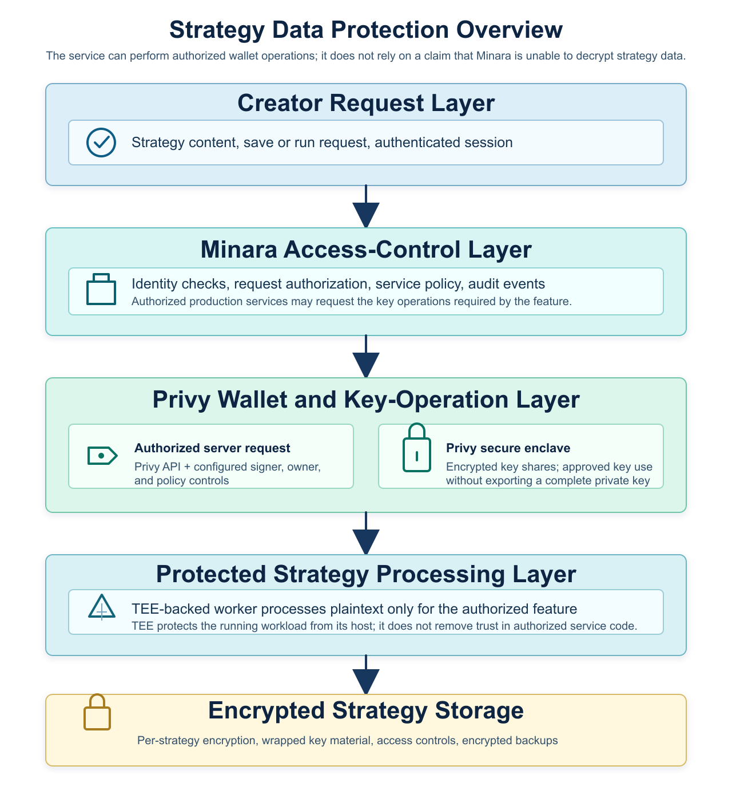

# Strategy data security

This page explains how Minara protects the private content of a strategy: the ideas, instructions, parameters, code, and saved versions you provide to create, save, or run it.

The important boundary is straightforward: Minara is the service operator for this path. A properly authorized Minara production service can request the wallet and encryption operations needed to provide a strategy feature. Strategy data is therefore **not end-to-end encrypted from Minara**. Instead, access is constrained through authentication, service policy, Privy-backed key operations, TEE isolation for sensitive workloads, encrypted storage, and operational controls.

This page does not describe the security of public blockchain data, the general security of your account, or all wallet permissions. See [Wallet security](wallet-security.md) for the wallet architecture.

## Overview

<figure><figcaption>
Strategy data follows a service-controlled, policy-enforced path. Privy protects wallet key custody; it does not make an authorized Minara service cryptographically unable to perform an approved operation.
</figcaption></figure>

## Scope

The protections in this page apply to **strategy content**:

- Strategy ideas, prompts, and instructions you enter.
- Strategy code, rules, configuration, parameters, and saved versions.
- Intermediate state created while that content is processed for an authorized feature.

They do not make public data private. Wallet addresses, on-chain transactions, account identifiers, request timing, approximate payload size, and feature usage may be processed by Minara's operational systems or be visible on the relevant blockchain. We treat that as operational data, not strategy content.

## The wallet and key trust boundary

Minara uses Privy-backed wallets. In the configured wallet model, Minara's backend can act as an authorized party: it can initiate wallet or key-operation requests needed for an approved feature, including automated actions that do not require the user to be present for each request.

That capability must not be confused with possession of a user's raw private key. In Privy's architecture, the complete wallet private key is reconstructed only temporarily inside its secure enclave for an authorized operation; encrypted key shares are kept across separate security boundaries. Minara's ordinary servers should receive the result of an approved operation, not an exportable complete private key.

Privy describes the underlying [secure-enclave architecture](https://docs.privy.io/security/wallet-infrastructure/architecture) and [server-side signer model](https://docs.privy.io/wallets/using-wallets/signers) in its documentation. Those materials describe Privy's platform controls; Minara's own access policies and feature configuration determine which authorized requests Minara permits.

For strategy data, the practical consequence is important: wallet-linked encryption or decryption is a **service-controlled access mechanism**, not a promise that only the creator can ever decrypt a strategy. If Minara's authorized backend can request the relevant key operation, it can enable the feature to access the strategy plaintext. Our controls are designed to make that access deliberate, authorized, limited to the feature, and auditable.


This is not a zero-knowledge or client-only-key design. Do not interpret the use of a wallet, a TEE, or encrypted storage as a guarantee that Minara cannot access strategy plaintext in every circumstance.


## How strategy content is processed

For a strategy feature that saves or runs strategy content, the processing flow is:

1. The creator sends the request over TLS using an authenticated Minara session.
2. Minara validates the session, the request, and the applicable service policy. The request is associated with the account, feature, and operational audit data needed to run it securely.
3. Where the feature requires wallet-linked key material, an authorized Minara service requests the allowed operation through the Privy wallet path. Privy's configured owner, signer, quorum, and policy controls determine whether the operation is permitted.
4. Privy's secure enclave performs the approved wallet-key operation using protected key shares. The complete wallet private key is not returned to Minara's ordinary application servers.
5. An authorized strategy worker obtains or unwraps the strategy encryption material required by the feature, decrypts the strategy content, and processes it. Sensitive strategy processing is designed to run in a TEE-backed workload where applicable.
6. The feature returns its result and stores a saved strategy as ciphertext. Strategy plaintext is not an intended field in ordinary databases, support tools, telemetry, or application logs.

The output is part of the trust boundary. A result can reveal information about its input if the feature is designed to return it. We limit outputs to what the requested feature needs, but no output should be treated as proof that nothing about the strategy can be inferred.

## What a TEE does, and does not do

A Trusted Execution Environment (TEE) is a hardware-backed isolated execution environment. It protects a running workload's memory from direct inspection by the surrounding host operating system, hypervisor, and infrastructure administrators while the workload is running.

Strategy content is not processed while it remains encrypted. It is decrypted when the authorized worker needs it and is handled inside the protected workload. The benefit of the TEE is isolation of that execution and its in-memory state from the host environment.

A TEE does **not** make the authorized workload, its permitted outputs, or Minara's authorization decisions untrustworthy by default. It does not protect against bugs or malicious logic in approved code, a compromised creator device or account, data deliberately shared by the creator, or every hardware and side-channel attack. TEE isolation is one layer of defense in depth, not a substitute for authorization and secure software operation.

## Encryption and key handling

Minara uses separate controls at separate stages:

| Stage | Protection and boundary |
| --- | --- |
| In transit | TLS protects the connection between the creator and Minara. |
| Service authorization | Minara authenticates the request and applies feature and account policy before a protected service can request a key operation. |
| Wallet operations | Privy-backed owner, signer, quorum, and policy controls govern wallet-key operations. Minara's backend can initiate an operation when it is configured and authorized to do so; it does not receive an exportable complete private key as part of the normal operation. |
| In use | An authorized strategy worker decrypts and processes the content. A TEE-backed worker, where used, isolates the workload from its host environment. |
| At rest | Each saved strategy is encrypted with a distinct data-encryption key (DEK). The database stores the ciphertext and wrapped or otherwise protected key material, not a plaintext strategy record. |

For a saved strategy, envelope encryption separates the content-encryption key from the storage record. Where wallet-linked material participates in wrapping, unwrapping, or authorizing access to that key, Minara's service may request that operation through the authorized wallet path. A database backup alone should not be sufficient to recover strategy plaintext; access also requires the relevant protected key material and service authorization.

Wallet-key custody and strategy-key custody are related only where a feature explicitly uses the wallet path to authorize strategy encryption material. A wallet private key is not a general-purpose promise that strategy content is unreadable by Minara.

## What Minara systems can handle

| Item | Handling |
| --- | --- |
| Strategy content in transit | Protected by TLS; received by Minara to provide the requested feature. |
| Strategy plaintext | May be handled by an authorized strategy worker when required for a requested feature. TEE isolation, where used, protects the worker from its host environment. |
| Saved strategy record | Stored as ciphertext with protected key material; retrieved only through the authorized service path. |
| Wallet private key | Not available in complete, exportable form to Minara's ordinary servers in the normal Privy operation path; complete-key use occurs temporarily inside the Privy secure enclave. |
| Wallet-key operation | May be initiated by an authorized Minara service under the configured Privy controls and policies. |
| Request metadata | May be processed by Minara for service delivery, security, support, and troubleshooting. |
| Feature result | Returned through the feature path; it may contain information the feature is designed to reveal. |

## Storage and retention

Minara stores saved strategies in encrypted form. Access to encrypted records is restricted to service components that need to store, retrieve, or serve them. Production access controls are intended to prevent strategy plaintext from being copied into ordinary logs, telemetry, or support tooling.

A strategy may be retained while you keep it in your account and for a limited period afterward where backup, security, legal, or accounting obligations require retention. Deleting a strategy removes it from the active product path and begins deletion from applicable systems under Minara's retention process. Backup copies can expire on a different schedule; they remain encrypted and access-controlled until removed.

## Third parties and feature boundaries

Minara does not send strategy plaintext to analytics or advertising providers.

Privy is a wallet infrastructure provider used for the authorized wallet-operation path described above. Its key-management protections do not expand Minara's access beyond the wallet configuration and policies, but a Minara service that is configured as an authorized party can use that path to provide an approved feature.

A feature that uses an external model or data provider can have a different data path. Before strategy content is sent outside Minara's protected strategy-processing path, the feature must identify what is sent and why. The protections in this page should not be read as a promise that an explicitly disclosed external-provider feature has the same boundary.

## Security commitments and limits

Minara's operational objective is to make strategy-data access purposeful rather than ambient:

- Require authenticated, authorized service requests before invoking wallet or strategy-key operations.
- Restrict production access to the components that need to deliver the feature, and record relevant security and access events.
- Keep saved strategy records encrypted and keep plaintext out of ordinary databases and observability systems.
- Use TEE-backed isolation for sensitive workloads where it is part of the feature's processing path.
- Review and update access controls, policies, and software as the product evolves.

These controls reduce exposure; they do not eliminate risk. They do not protect against compromised devices, accounts, or authorized service code; strategy content you export or share; outputs that reveal the strategy by design or inference; public blockchain data; TEE side-channel or firmware attacks; availability failures; incorrect results; or custody risks associated with wallet and trading operations.

## Your controls

- You control whether to save a strategy and can delete saved strategies through the product where that option is available.
- You can request access to or deletion of account data by contacting the security team.
- You should keep your device, wallet, recovery material, and account credentials secure. No service-side control can protect strategy content after those are compromised or you choose to share it.

## Reporting a security issue

If you believe you have found a vulnerability or have a question about strategy-data handling, contact Minara's security team at `security@minara.ai`. Please include enough detail to reproduce the issue. Minara does not take legal action against good-faith security research.

## Changes to this statement

Minara may update this statement as the product and its infrastructure change. Material changes will be noted here, and the date below reflects the most recent revision.

_Last updated: 15 July 2026_
