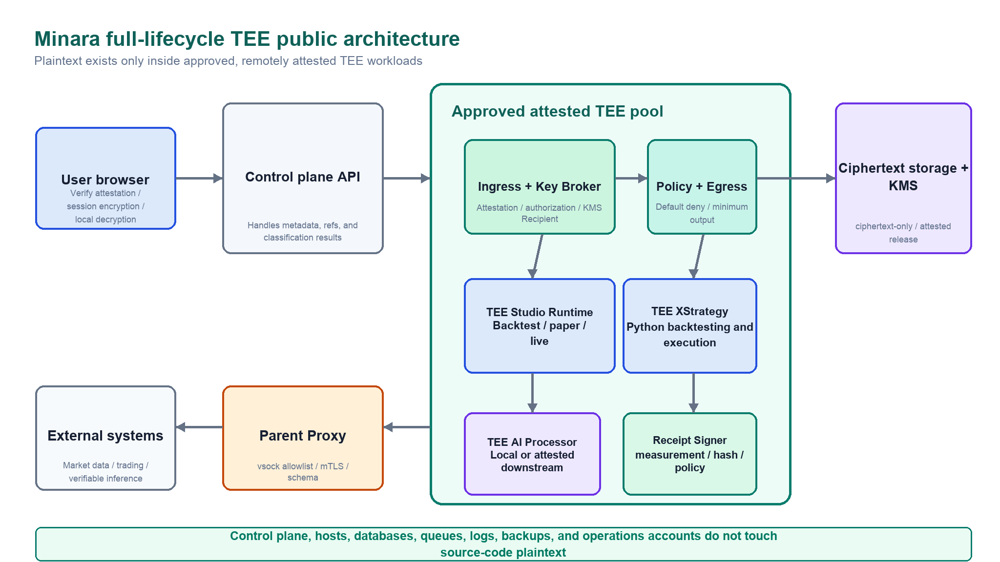
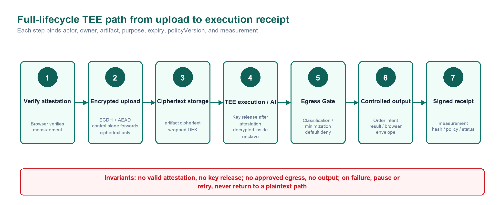

# TEE-based Data Security

Minara has deployed the full lifecycle of confidential strategy source code inside remotely attested hardware trusted execution environments (TEE). From encrypted browser upload, ciphertext storage, AI code processing, backtesting, paper trading, and live trading, to order intent output, source-code viewing, and execution receipt generation, plaintext source code exists only briefly inside approved TEE workloads. Ordinary APIs, workers, hosts, databases, caches, queues, logs, backups, and operations accounts cannot obtain plaintext source code.

Before upload, the user's browser verifies the TEE's remote attestation and approved measurement, then establishes a short-lived encrypted session with the enclave. The control plane only forwards ciphertext, artifact references, authorization tickets, and metadata that does not contain source code. Source code is encrypted with an independent DEK using AEAD. The storage layer keeps only ciphertext, wrapped DEK, context, and signed receipts. KMS encrypts key material to a designated enclave only when attestation, purpose, image, and policy conditions are all satisfied.

Strategy Studio, XStrategy, and AI tasks process source code in isolated TEE runtimes. Market data and required external dependencies enter through a controlled vsock proxy. Every output first passes through an in-enclave egress policy that applies default deny and minimization by purpose, destination, field, and size. The trading system receives only classified order intent. AI handles original source code only inside the enclave or through an attested confidential downstream. Ordinary model providers do not receive plaintext source code.

Every upload, view, AI processing task, or strategy execution generates a verifiable receipt bound to the artifact hash, input and output commitments, runtime measurement, policyVersion, purpose, time, and result status. If attestation fails, key policy does not match, or egress is denied, the system pauses or retries the task. It does not downgrade to a plaintext backend path.

## Architecture for full-lifecycle TEE

<figure><figcaption></figcaption></figure>

### Three core boundaries

| Boundary                 | Responsibilities                                                                                                  | Explicitly does not touch                                |
| ------------------------ | ----------------------------------------------------------------------------------------------------------------- | -------------------------------------------------------- |
| User side                | Verify attestation, establish an encrypted session, locally decrypt the source-code envelope, and verify receipts | Platform internal keys and other users' data             |
| Control plane            | Identity, owner, purpose, job, artifact ref, policy tickets, status, and classification results                   | Source code, DEK, debug plaintext, and raw AI context    |
| TEE data plane           | Decryption, validation, AI, backtesting, paper/live, egress decisions, rewrapping, and signed receipts            | Unapproved network destinations and unclassified output  |
| Ciphertext storage / KMS | Store ciphertext and wrapped DEK; release keys according to RecipientAttestation conditions                       | Plaintext source code and ordinary KMS Decrypt plaintext |

## From upload to execution receipt

<figure><figcaption></figcaption></figure>

### Seven-step protection chain

1. Attestation verification: the client or task scheduler first verifies the approved measurement, signature chain, nonce, time, and policy version.
2. Encrypted upload: the browser establishes a short-lived ECDH session with the TEE, then uploads the source code, operation, and context in an AEAD envelope.
3. Ciphertext write: the TEE validates the source code and generates a DEK. It writes only ciphertext, wrapped DEK, context, and receipt.
4. Key release after attestation: the TEE runtime requests KMS with RecipientAttestation. If the conditions are not met, no usable key is returned.
5. Confidential execution: AI, backtesting, and paper/live run inside independent TEE pools. State and checkpoints are encrypted again before persistence.
6. Controlled output: the egress gate outputs minimal order intent, results, or browser-session envelopes according to destination and field allowlists.
7. Verifiable receipt: the result is bound to measurement, artifact/input/output hash, policy, purpose, time, and status, then signed.

