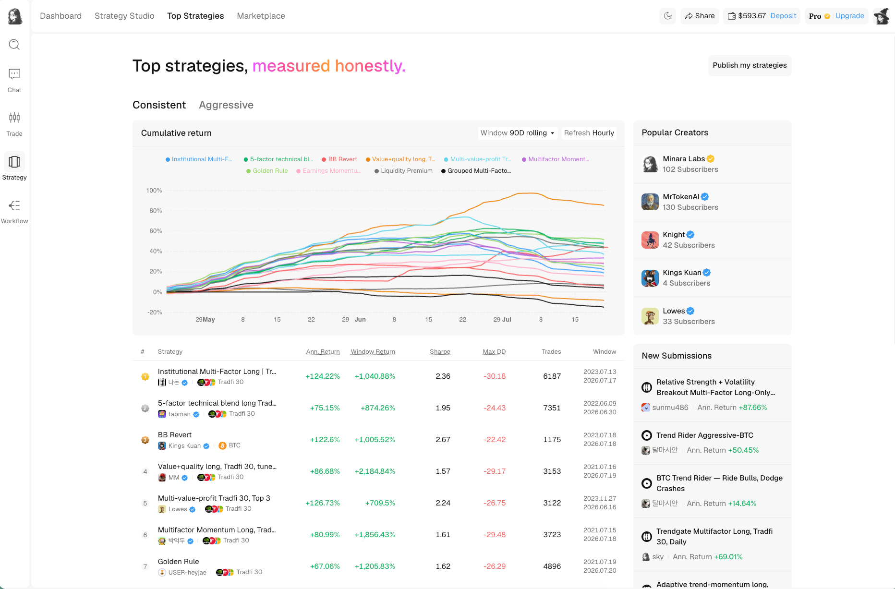
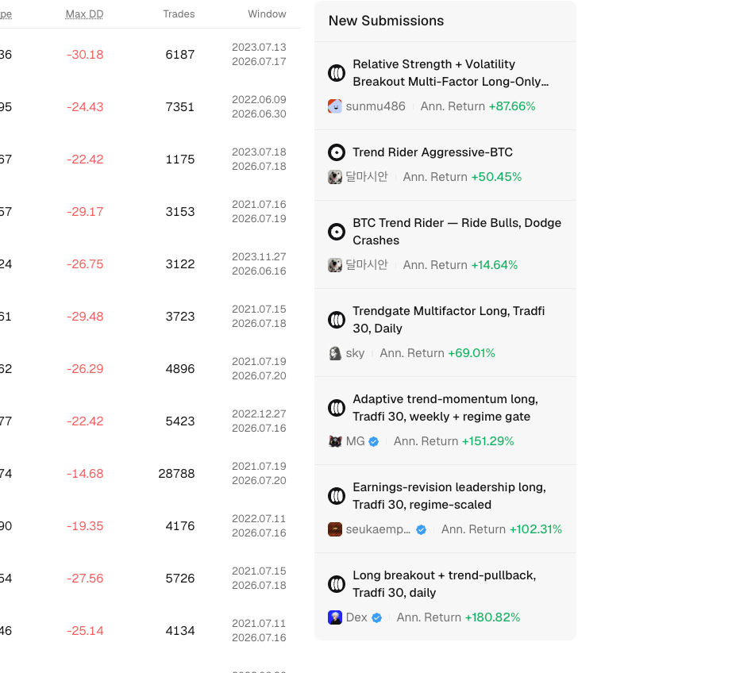

# Compare Top Strategies

Top Strategies compares published strategies on a common ranking screen. Use it to build a shortlist, then open each strategy page before making a decision.

<figure><figcaption>Top Strategies combines a visual comparison with the measurements behind the ranking.</figcaption></figure>

## Choose a ranking view

The page has two views:

* `Consistent` emphasizes strategies with steadier performance.
* `Aggressive` surfaces strategies that accept more risk in pursuit of higher returns.

Neither view is a recommendation. It changes the comparison lens, not the uncertainty of live trading.

## Read the chart and table together

The cumulative return chart compares strategies over the selected rolling window. Use the chart to see when returns developed, whether strategies moved together, and whether one result depends on a short burst.

The table provides the measurements behind each line:

| Column | What it tells you |
| --- | --- |
| Annualized Return | The measured return converted to a yearly rate. Short windows can make this number look unusually large. |
| Window Return | The total return over the displayed measurement window. |
| Sharpe | Return relative to volatility. Compare it with drawdown rather than using it alone. |
| Max DD | The largest peak-to-trough decline in the measured period. |
| Trades | The number of fills or trades supporting the result. A small sample is easier to overinterpret. |
| Window | The start and end of the record displayed for that strategy. |

The chart can use a rolling comparison window and refresh as new performance data arrives. Rankings may therefore change even when the underlying strategy has not been edited.

## Popular creators and new submissions

`Popular Creators` links to public creator profiles. It is useful when you want to review several publications from the same person.

`New Submissions` surfaces recently published strategies before they have a long public history.

<figure><figcaption>New submissions may have less post-publication evidence than established strategies.</figcaption></figure>

Treat a new submission as a starting point for research. Check its backtest window, live-forward segment, drawdown, and creator before relying on the displayed annualized return.


High rank, verification, or popularity does not guarantee future performance. A strategy can fall in rank as the market regime changes or new live data arrives.

