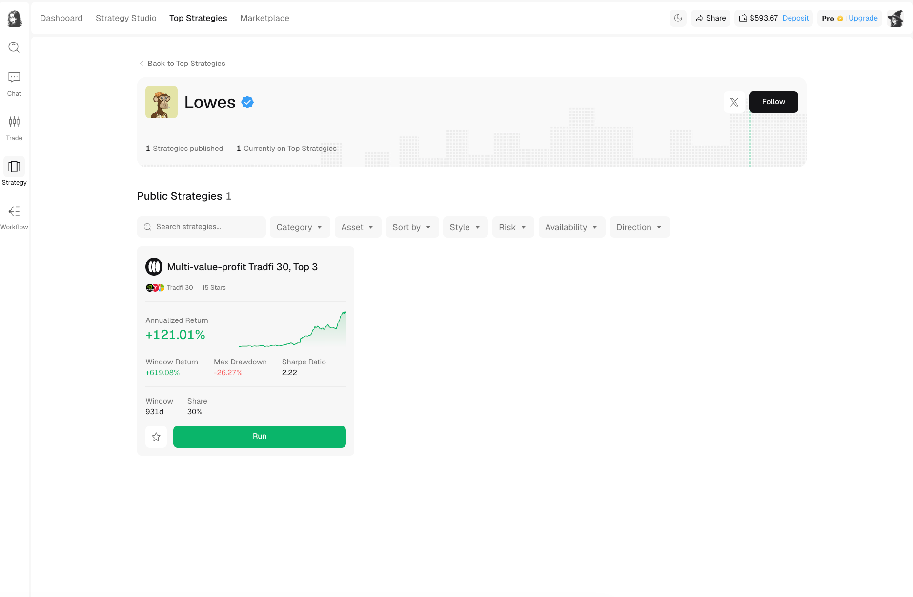

# Creators and profiles

Every published strategy belongs to a creator profile. Open the creator name from a strategy card or detail page to learn who published it and to review their other public strategies.

<figure><figcaption>A creator profile groups identity and publication history; each strategy still needs its own review.</figcaption></figure>

## What a profile shows

A public profile can include:

* Display name, avatar, banner, and bio.
* Verification status.
* Links to public social channels.
* Number of strategies published.
* Number currently appearing on Top Strategies.
* Public strategy cards with their current measurements.

Select `Follow` to follow the creator. Select a strategy card to open its detail page, or use `Run` after you have completed your review.

## How to interpret verification

A verification badge is a profile-level status. It does not verify future returns, remove market risk, or guarantee that every strategy from that creator will perform similarly.

Check each publication separately. Two strategies from the same creator can trade different markets, use different rules, and carry different drawdown or concentration risk.

## Compare a creator's strategies

When a creator has multiple public strategies:

1. Compare the markets and strategy categories first.
2. Check whether the records overlap in time.
3. Compare maximum drawdown and live-forward performance, not only annualized return.
4. Look for concentration in the same assets or market regime.

Following a creator does not subscribe your wallet to their strategies or start an Autopilot run.
