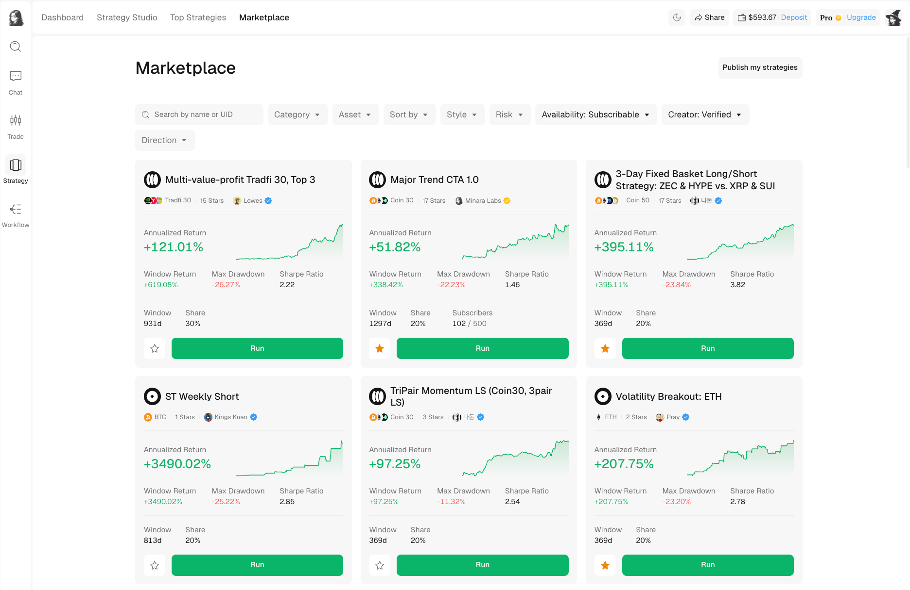

# Discover strategies

Marketplace is the full catalog of published strategies. Search by name or UID, then combine filters to narrow the results before opening a strategy page.

<figure><figcaption>
Marketplace groups strategy discovery, comparison, and the first step of the run flow.
</figcaption></figure>

## Search and filters

Start with the filter that matters most to you, then add constraints until the list is manageable.

<table><thead><tr><th width="125.0718994140625">Filter</th><th>What it narrows</th><th>How to use it</th></tr></thead><tbody><tr><td>Search</td><td>Strategy name or UID</td><td>Find a known publication directly.</td></tr><tr><td>Category</td><td>Time-Series or Cross-Sectional</td><td>Choose between strategies that time one market and strategies that rank a basket.</td></tr><tr><td>Asset</td><td>A universe or individual market</td><td>Limit the catalog to markets you are willing to trade.</td></tr><tr><td>Sort by</td><td>Featured, APY, Sharpe, Calmar, or Max DD</td><td>Order results by the measurement you want to compare.</td></tr><tr><td>Style</td><td>Trend following, swing, mean reversion, breakout, arbitrage, market making, or other</td><td>Match the strategy to the behavior you understand.</td></tr><tr><td>Risk</td><td>Conservative, balanced, or aggressive</td><td>Narrow by the publication's risk classification.</td></tr><tr><td>Availability</td><td>Subscribable or open source</td><td>Separate strategies you can run from those whose source can be viewed or forked.</td></tr><tr><td>Creator</td><td>All or verified</td><td>Limit the catalog by profile verification status when needed.</td></tr><tr><td>Direction</td><td>Available exposure choices</td><td>Filter by the market direction or exposure the strategy uses.</td></tr></tbody></table>

Filters are discovery tools, not an assessment of quality. For example, `Conservative` is a classification attached to the publication; it does not guarantee a small future drawdown.

## Read a strategy card

A card summarizes the publication so you can decide whether to inspect it further:

* **Name and market** identify what the strategy trades.
* **Creator and verification badge** identify who published it.
* **Annualized Return or Window Return** shows the return measure selected for that card.
* **Max Drawdown** shows the largest historical peak-to-trough decline in the displayed record.
* **Sharpe Ratio** relates return to volatility over the measured period.
* **Window** shows how much data is included.
* **Share** shows the configured creator profit-share rate for a subscribable strategy.
* **Subscribers** appears when the publication reports its current subscriber count and limit.

The sparkline is useful for seeing the path behind the headline return. A smooth line, a late surge, and a long flat period can produce similar final numbers but imply different behavior.

## Save or open

Select the star icon to save a strategy to the `Starred` tab on your profile. Select the card to open the full detail page.

Use `Run` only after reading the detail page. The card is a summary and does not show the complete backtest, drawdown history, trading costs, or live-forward record.
