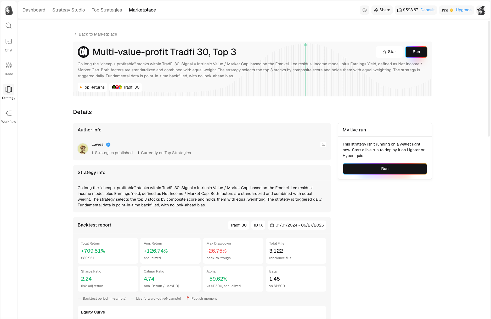
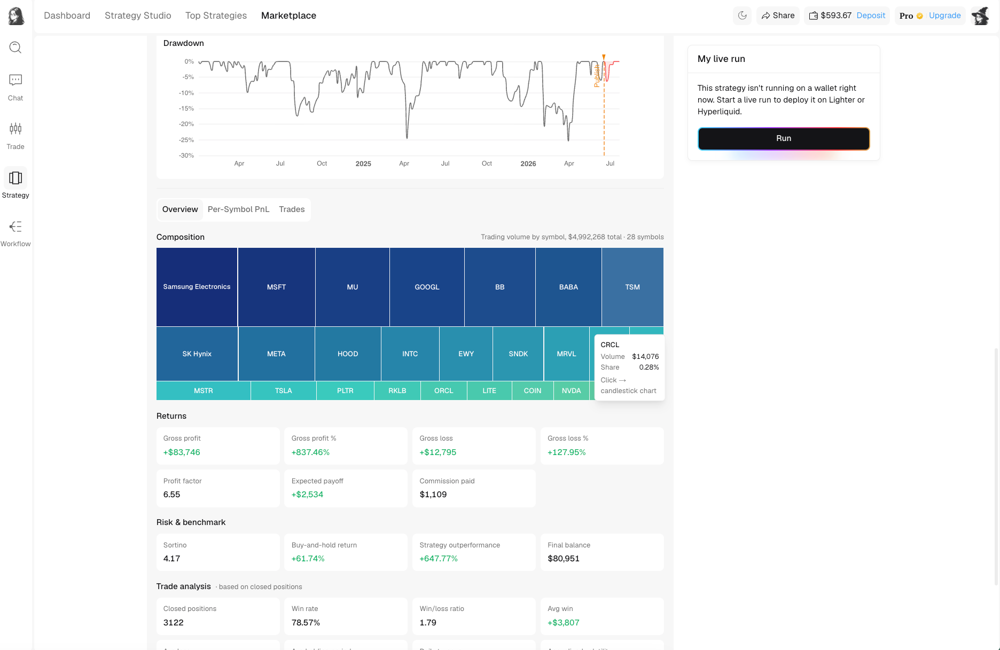

# Evaluate a strategy

Open a strategy from Marketplace, Top Strategies, a creator profile, or your Starred list to see its full record. Evaluate the strategy page before you start a live run.

<figure><figcaption>The detail page connects the creator's description with the evidence produced by the strategy.</figcaption></figure>

## Start with the context

The top of the page identifies the strategy, the market or universe it trades, and its creator. Read these sections first:

* **Strategy info** explains what the strategy is intended to do. Treat it as the creator's description, then check whether the data supports it.
* **Author info** shows who published the strategy and links to the creator's public profile.
* **My live run** shows whether you already run this strategy and provides the entry point for starting it.

## Separate backtest from live-forward performance

The performance chart distinguishes three parts of the record:

* **Backtest period (in-sample)** shows how the rules behaved on historical data.
* **Publish moment** marks when the strategy became public.
* **Live forward (out-of-sample)** shows performance recorded after publication.

Do not read these as one continuous live track record. A backtest helps you understand the rules across historical conditions. The live-forward segment tests how the published version behaved after it was exposed to new market data.

## Read return and risk together

| Measurement | What to ask |
| --- | --- |
| Total Return | How much did the strategy gain or lose across the full displayed period? |
| Annualized Return | Is the measurement window long enough for an annualized rate to be meaningful? |
| Max Drawdown | What was the worst historical decline, and could your allocation tolerate a similar or larger loss? |
| Sharpe Ratio | Did the strategy earn its return with relatively stable or volatile results? |
| Calmar Ratio | How much annualized return was produced relative to maximum drawdown? |
| Alpha and Beta | What benchmark-adjusted excess return is reported, and how sensitive was the strategy to the benchmark? |
| Total Fills | Is there enough activity to evaluate, and could turnover make costs important? |

No single measurement answers whether a strategy is suitable. A high return with severe drawdown, a high Sharpe over a short window, or a strong backtest with little live-forward data all require caution.

## Inspect the full report

<figure><figcaption>The lower report explains where the headline result came from.</figcaption></figure>

The lower report adds several checks:

* **Equity and drawdown charts** show the path of returns and the depth and duration of declines.
* **Composition** shows trading volume by symbol. A large block indicates that more of the measured trading volume came from that symbol.
* **Per-Symbol PnL** separates results by market so one outlier does not hide weak performance elsewhere.
* **Trades** lets you inspect the underlying trading activity.
* **Returns** includes gross profit, gross loss, profit factor, expected payoff, and commission paid.
* **Risk & benchmark** compares the strategy with a reference market and reports downside-sensitive measurements.
* **Trade analysis** shows the number of closed positions, win rate, win/loss ratio, and average results.

## A practical review order

1. Confirm what the strategy trades and how often it acts.
2. Check the measurement window and sample size.
3. Compare return with maximum drawdown.
4. Locate the publish marker and examine the live-forward segment.
5. Review fees or commission and the number of fills.
6. Check trading-volume concentration and per-symbol results for multi-asset strategies.
7. Read the creator profile and other public strategies.

Only then decide whether to save the strategy, run it with an appropriate allocation, or continue researching.
