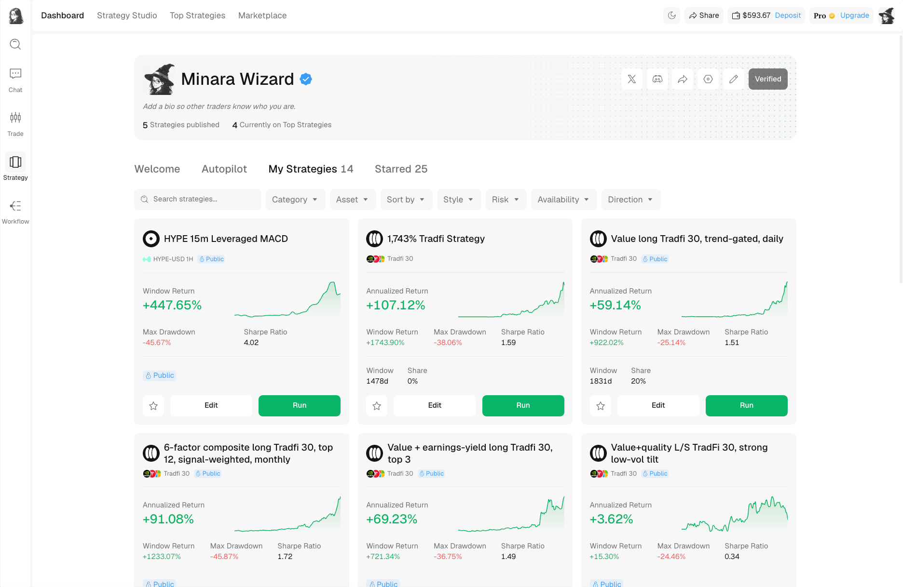
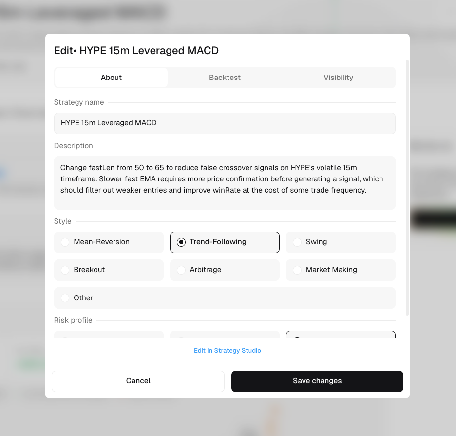
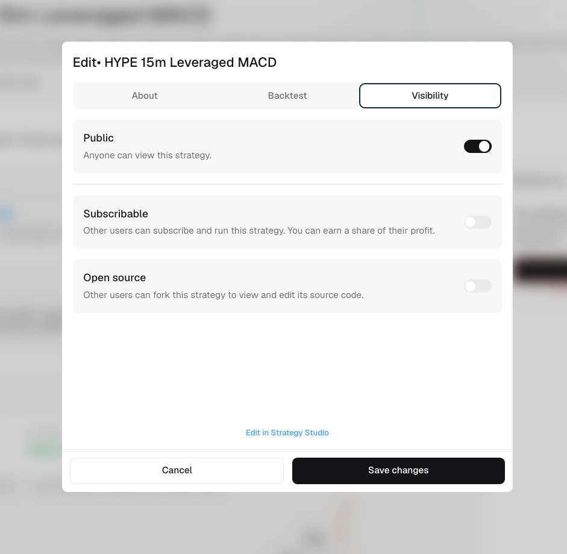

# Publish and manage

Creators use Strategy Studio to build the trading logic and Strategy Market to present and distribute the published version. Your profile's `My Strategies` tab is the starting point for managing those publications.

Select `Publish my strategies` from Marketplace or Top Strategies to open the creator flow, or open your profile and go directly to `My Strategies`.

<figure><figcaption>My Strategies contains both public and non-public strategies attached to your account.</figcaption></figure>

## Find the strategy

Open your profile and select `My Strategies`. Use search and filters to find the strategy you want to manage.

Each card can show its current measurements, publication status, and controls:

* `Public` marks a strategy that other users can discover.
* `Edit` opens the publication editor.
* `Run` starts the strategy in one of your own wallets.
* The star icon saves the strategy to your Starred list.

Publishing and running are separate actions. Publishing makes a strategy discoverable; it does not start a live run in your account.

## Edit the market listing

Open `Edit` from My Strategies or use the pencil button on the owner view of a strategy page.

<figure><figcaption>The About tab changes the listing, not the underlying trading logic.</figcaption></figure>

The `About` tab controls how the strategy is presented:

| Field | What to include |
| --- | --- |
| Strategy name | A specific name that distinguishes the publication from your other strategies. |
| Description | The market, main signal or factor, trading cadence, and intended risk behavior. |
| Style | The closest trading behavior, such as mean reversion, trend following, swing, breakout, arbitrage, or market making. |
| Risk profile | The classification that best matches the strategy and its backtest. |

Use the `Backtest` tab to review the result attached to the publication. The description and the displayed backtest should refer to the same strategy version.

Select `Edit in Strategy Studio` when you need to change code, signals, parameters, asset universe, timeframe, or execution rules. Run a new backtest after changing the trading logic.

## Set visibility and availability

<figure><figcaption>Visibility settings determine how other traders can access the publication.</figcaption></figure>

| Setting | Effect |
| --- | --- |
| Public | Other users can find and view the strategy. |
| Subscribable | Eligible users can subscribe and run it. The source remains private unless `Open source` is also enabled. |
| Open source | Other users can view and fork the source code. |

When `Subscribable` is enabled, review the profit-share rate, minimum and maximum investment amounts, and subscriber limit shown by the editor. The profit-share rate is the percentage of a subscriber's strategy profit allocated to the creator.

To remove the strategy from public discovery, turn off `Public` and save. Review its existing subscribers and live-run state before unpublishing.

## Review subscribers and creator earnings

Open the published strategy's owner view, then select `Subscriber Overview`. Use it to review the subscriber information and profit-share data available for that publication.

Subscriber data belongs to a specific strategy publication. Check the strategy name before changing its profit-share rate, investment limits, or subscriber cap.

## Keep your creator profile current

The pencil control on your profile opens profile editing. You can update the banner, avatar, display name, bio, website, and supported social links. These details help traders identify the creator behind a strategy, but they do not replace a clear strategy description or a complete performance record.
