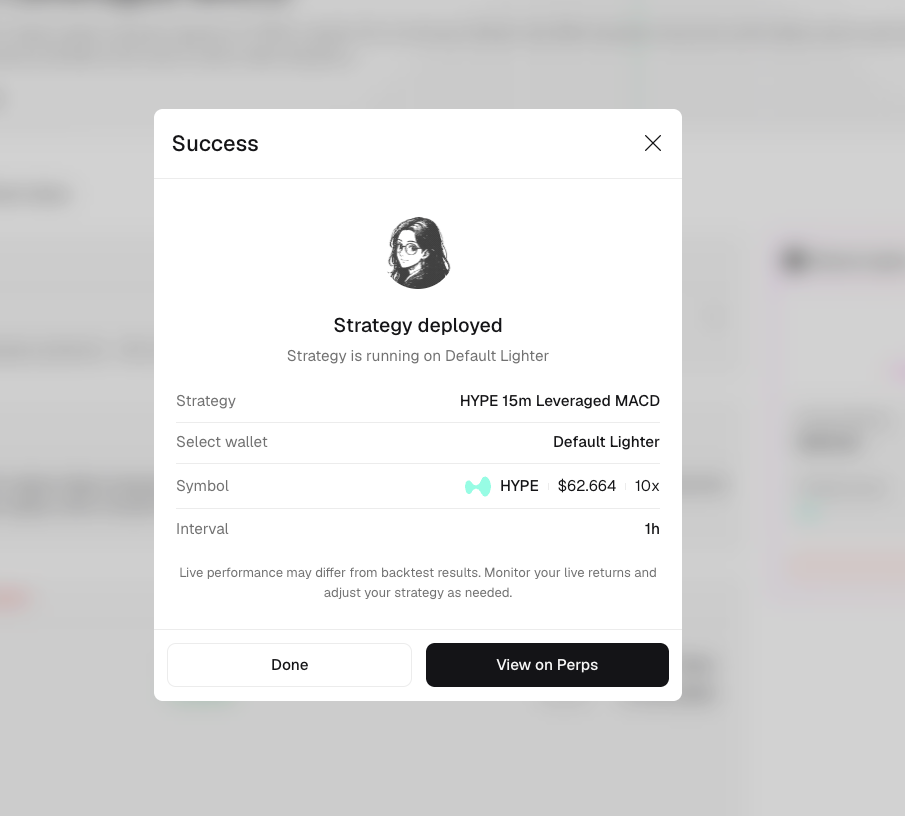

# Run a strategy

Run a published strategy only after reviewing its description and intended behavior, performance window, live-forward record, drawdown, costs, and creator. The strategy executes through Autopilot using a wallet you select.

## Before you run

Complete the checks in [Evaluate a strategy](evaluate-a-strategy.md), then confirm these details for the live run:

1. The market or universe the strategy trades.
2. Whether it is time-series or cross-sectional.
3. The wallet and supported trading venue you plan to use.
4. The strategy interval and any allocation settings shown in the run flow.
5. The fees, liquidity, and drawdown risk your allocation can tolerate.


A backtest is not a live guarantee. Execution, liquidity, fees, funding costs, market conditions, and your allocation can all change the result.


## Start the run

Select `Run` from a strategy card, the strategy header, or the `My live run` panel. Review the strategy, wallet, market, interval, and any allocation or venue settings shown in the confirmation flow.

Your wallet determines where the live strategy executes when more than one supported venue is available.

## Confirm deployment

<figure><figcaption>Check the strategy and wallet on the confirmation screen before leaving the flow.</figcaption></figure>

The success screen confirms:

* The strategy that was deployed.
* The selected wallet.
* The traded symbol or universe.
* The strategy interval.

Select `View on Perps` to open the live trading view, or `Done` to return to Strategy Market.

## Monitor the live run

Open your profile and select `Autopilot` to monitor the strategy. Review Total PnL, 30D PnL, Unrealized PnL, runtime, open positions, orders, and trade history.

The public strategy record and your personal live run answer different questions. The public page describes the shared strategy publication; your Autopilot view reports what happened in your wallet after your own start time and allocation.

## Save without running

Select the star icon to add a strategy to `Starred`. This saves it for later review and does not allocate funds or start trading.
